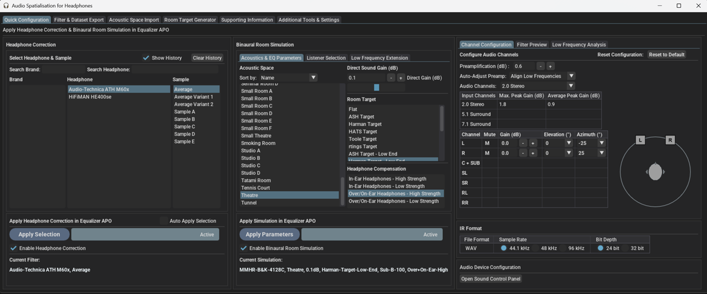
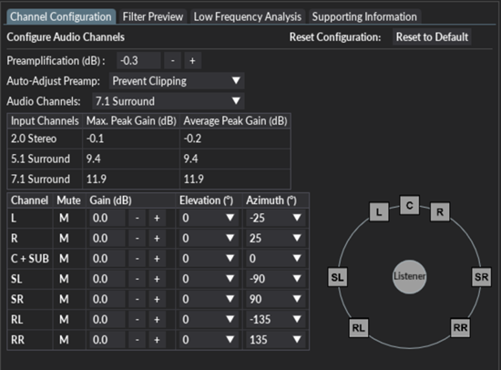

**A Windows distribution of this project is available here: [https://sourceforge.net/projects/ash-toolset/](https://sourceforge.net/projects/ash-toolset/)**

***

### Table of Contents
1. [Features](#Features)
2. [Background](#Background)
3. [Getting Started](#Getting-Started)
4. [Usage](#Usage)
5. [Supporting Information](#Supporting-Information)
6. [License](#License)
7. [Contact](#Contact)
8. [Acknowledgments](#Acknowledgments)

# ASH Toolset
The Audio Spatialisation for Headphones Toolset is a set of tools for headphone correction and binaural synthesis of spatial audio systems on headphones



## Features <a name="Features"></a> 
- **Headphone Correction** — Generate headphone correction filters in WAV format for IR convolution or as configurations for graphic equalisers.
- **Binaural Room Simulation** —  Generate customised binaural simulations of different acoustic environments including control rooms, studios, halls, and more. Resulting filters can be saved in WAV format or SOFA format for IR convolution.
- **Equalizer APO Integration** —  Auto configures Equalizer APO to apply created filters and perform headphone correction and binaural room simulation.
- **HeSuVi Compatibility** —  Generates filters in formats compatible with HeSuVi, a headphone surround virtualization tool for Equalizer APO.
- **SOFA Format Compatibility** - Load HRTF datasets and export customised binaural responses in SOFA format

## Background <a name="Background"></a> 

### Binaural Room Impulse Responses
Binaural room impulse responses (BRIRs) are measurements that capture the spectral filtering properties of the head and ears, as well as the loudspeakers and any room reverberation present. Measurements are typically made in reverberant rooms using dummy heads that are rotated above their torso to capture multiple head orientations for a number of source locations within the room. One key application of BRIRs is the synthesis of spatial audio over headphones. Convolution of an audio signal with a BRIR converts the audio to that which would be heard by the listener if it had been played at the source location. This process can be repeated for all channels in the audio signal and their respective source locations in the room to create spatial surround sound on headphones.

The ASH Toolset can be used to generate and apply sets of BRIRs that can be customised to achieve a desired acoustic simulation over headphones. Distance, acoustic environment, listener, headphone type and room target response can be customised to the user's preference.

### Headphone Correction Filters
A significant source of spectral colouration impacting the quality of binaural simulations is the headphones used for binaural reproduction. A common design goal for headphone calibration is the diffuse-field target which minimises spectral colouration of stereo signals on headphones. Binaural measurements that have been diffuse-field calibrated will be compatible with these types of headphones. As the binaural responses produced by the toolset are diffuse-field calibrated (prior to applying room targets), headphones should also be diffuse-field equalised to ensure compatibility in terms of timbral quality. 

Although diffuse-field calibrated headphones are common, differences in frequency responses across headphones are considerably large. Individual headphone equalisation is therefore recommended to compensate for the unique and undesired spectral colouration introduced by the listener's headphones.  

The ASH Toolset can be used to generate and apply Headphone Correction Filters (HpCFs) for a wide range of headphones. The filters can be used to equalise individual headphones to the diffuse-field target response and remove undesired spectral colouration introduced by the headphones.


## Getting Started <a name="Getting-Started"></a> 

ASH Toolset is a python app built with Python, Numpy, Scipy, & DearPyGui.\
Developed on Python 3.11.7.\
Tested on Windows 10 and Windows 11 with Equalizer APO 1.4 and Voicemeeter 1.1.1.8

### Prerequisites

Python libraries:
  ```sh
  pip install dearpygui==2.0.0
  pip install dearpygui-ext==2.0.0
  pip install dearpygui-extend==0.1.5
  pip install mat73==0.63
  pip install matplotlib==3.7.0
  pip install numpy==2.2.4
  pip install pandas==2.2.3
  pip install pyfar==0.6.5
  pip install scipy==1.11.4
  pip install soundfile==0.12.1
  pip install gdown==5.2.0
  pip install librosa==0.10.2.post1
  pip install thefuzz==0.22.1
  pip install fuzzywuzzy==0.18.0
  pip install SOFASonix==1.0.7
  pip install sofar==1.2.1
  pip install h5py==3.11.0
  pip install noisereduce==3.0.2
  pip install Requests==2.32.3
  ```
Data files:

HRIR, BRIR and filter datasets are required in the data folder to run the app. Due to large file sizes the data files are stored using google drive.\
[Link to data folder](https://drive.google.com/drive/folders/1Yp3NQoxPji8y_DrR8azFvbteml8pTscJ?usp=drive_link)

Optional:
- [Equalizer APO](https://sourceforge.net/projects/equalizerapo/), an audio processing object for windows featuring IR convolution and Graphic EQ capabilities.
- [HeSuVi](https://sourceforge.net/projects/hesuvi/), a headphone surround virtualization tool for Equalizer APO.

  
### Installation

1. Clone the repo
2. Download the data folder from google drive
3. Extract data folder to ASH-Toolset root folder
4. (optional) If using Equalizer APO for the first time, download [Equalizer APO](http://sourceforge.net/projects/equalizerapo) and follow the Equalizer APO [installation tutorial](https://sourceforge.net/p/equalizerapo/wiki/Documentation/#installation-tutorial). 


## Usage <a name="Usage"></a> 

Run the ash_toolset.py using python to launch the GUI
```sh
python C:\sample-location\ASH-Toolset\ash_toolset.py
```

### GUI Overview
The app contains the following 3 tabs:
- The 'Quick Configuration’ tab can be used to directly apply headphone correction and binaural room simulation in Equalizer APO
- The ‘Filter & Dataset export’ tab can be used to export correction filters and binaural datasets to a local directory
- The ‘Additional Tools & Settings’ tab contains some miscellaneous options and log messages

### Headphone Correction
In the 'Quick Configuration’ tab, this tool is used to apply headphone correction in Equalizer APO. In the ‘Filter & Dataset export’ tab, this is used to export a set of correction filter files for a specific headphone which can then be loaded into audio processing software to apply headphone correction.
1. **Select a headphone brand** to filter down on the headphone list.
2. **Select a specific headphone**.
3. **Select a specific sample**. Note that in the ‘Filter & Dataset export’ tab, all samples will be exported for the selected headphone.
4. (‘Filter & Dataset export’ tab only) Select which files to include in the export.
   - FIR Filters: Minimum phase FIRs in WAV format for convolution. 1 channel at specified sample rate and bit depth. This is filter type is required for the app to auto-configure 'config.txt' in Equalizer APO.
   - Stereo FIR Filters: Minimum phase FIRs in WAV format for convolution. 2 channels at specified sample rate and bit depth.
   - E-APO Configuration files: configuration files that can be loaded into Equalizer APO to perform convolution with the FIR filters. This feature is deprecated from V2.0.0 onwards due to inclusion of auto-configure 'config.txt' feature.
   - Graphic EQ Filters (127 bands): Graphic EQ configurations with 127 bands. Compatible with Equalizer APO and Wavelet
   - Graphic EQ Filters (31 bands): Graphic EQ configurations with 31 bands. Compatible with 31 band graphic equalizers including Equalizer APO
   - HeSuVi Filters: Graphic EQ configurations with 127 bands. Compatible with HeSuVi. Saved in HeSuVi\eq folder
5. **Select a sample rate** for the WAV files. Available options are 44.1kHz, 48kHz, and 96kHz. Note: The sample rate of the generated fitlers should match the sample rate of the sound device.
6. **Select a bit depth** for the WAV files. Available options are 24 bits per sample and 32 bits per sample.
7. **Click the 'Apply Selection' button** to apply the selected filter in Equalizer APO or **click the 'Process' button** to export the selected filters to the output directory. By default this location will be `C:\Program Files\EqualizerAPO\config\ASH-Outputs` but can be changed using the change folder option.


### Binaural Room Simulation over Headphones
#### Quick Configuration
In the 'Quick Configuration’ tab, this tool is used to apply customised binaural room simulations over headphones in equalizer APO. 
1. **Select acoustic space** from a range of environments including audio labs, conference rooms, control rooms, seminar rooms, studios, and more. This will determine the listening environment of the simulation.
2. **Select Gain for Direct Sound** in dB. Select a value between -10dB and 10dB. Higher values will result in lower perceived distance. Lower values result in higher perceived distance
3. **Select Room Target** from a range of options including flat, ASH target, Harman target, and more. This will influence the overall balance of low and high frequencies. Flat is recommended if using headphone correction from other sources such as AutoEq. Variations of below targets with flat mid and high frequencies are also provided.
4. **Select Headphone Compensation** from below options. The selected option should match the listener's headphone type. High strength is selected by default. Reduce to low strength if sound localisation or timbre is compromised.
   - In-Ear Headphones, high strength
   - In-Ear Headphones, low strength
   - Over-Ear/On-Ear Headphones, high strength
   - Over-Ear/On-Ear Headphones, low strength
5. **Select Listener Type** from below options.
   - Dummy Head / Head & Torso Simulator
   - Human Listener
   - User SOFA Input
6. **Select Dataset** from available options. A number of public HRTF datasets will be listed here if ‘Listener Type’ is set to 'Dummy Head / Head & Torso Simulator' or 'Human Listener'.
7. **Select Listener** from available options. Some options will require an internet connection as the source dataset is not included and will be automatically downloaded from the web. If ‘Listener Type’ is set to ‘User SOFA Input’, user SOFA files will be automatically listed here. User SOFA files must be placed in the user data folder which is usually located at `C:\Program Files (x86)\ASH Toolset\_internal\data\user\SOFA`. Additional SOFA files can be found at the [SOFA conventions repository](https://www.sofaconventions.org/mediawiki/index.php/Files). 
8. **Select a sample rate** for the WAV files. Available options are 44.1kHz, 48kHz, and 96kHz. Note: The sample rate of the generated BRIRs should match the sample rate of the sound device.
9. **Select a bit depth** for the WAV files. Available options are 24 bits per sample and 32 bits per sample.
10. **Click the 'Apply Parameters' button** to apply the binaural simulation in Equalizer APO.


#### Filter & Dataset export
In the ‘Filter & Dataset export’ tab, this is used to export a customised binaural dataset containing binaural impulse responses in WAV or SOFA format which can then be loaded into audio processing software to apply room simulation.
1. **Select acoustic space** from a range of environments including audio labs, conference rooms, control rooms, seminar rooms, studios, and more. This will determine the listening environment of the simulation.
2. **Select Gain for Direct Sound** in dB. Select a value between -10dB and 10dB. Higher values will result in lower perceived distance. Lower values result in higher perceived distance
3. **Select Room Target** from a range of options including flat, ASH target, Harman target, and more. This will influence the overall balance of low and high frequencies. Flat is recommended if using headphone correction from other sources such as AutoEq. Variations of below targets with flat mid and high frequencies are also provided.
4. **Select Headphone Compensation** from below options. The selected option should match the listener's headphone type. High strength is selected by default. Reduce to low strength if sound localisation or timbre is compromised.
   - In-Ear Headphones, high strength
   - In-Ear Headphones, low strength
   - Over-Ear/On-Ear Headphones, high strength
   - Over-Ear/On-Ear Headphones, low strength
5. **Select spatial resolution** from below options. Increasing resolution will increase number of source directions available but will also increase processing time and dataset size. Low' is recommended unless additional directions or SOFA export is required.
   - Low: Elevation angles ranging from -30 to 30 degrees in 15 degree steps. Azimuth angles ranging from 0 to 360 degrees in varying steps.
   - Medium: Elevation angles ranging from -45 to 45 degrees in 15 degree steps. Azimuth angles ranging from 0 to 360 degrees in varying steps.
   - High: Elevation angles ranging from -50 to 50 degrees (WAV export) or -60 to 60 degrees (SOFA export) in 5 degree steps. Azimuth angles ranging from 0 to 360 degrees in 5 degree steps.
   - Max: Elevation angles ranging from -40 to 40 degrees (WAV export) or -40 to 60 degrees (SOFA export) in 2 degree steps. Azimuth angles ranging from 0 to 360 degrees in 2 degree steps.
6. **Select Listener Type** from below options.
   - Dummy Head / Head & Torso Simulator
   - Human Listener
   - User SOFA Input
7. **Select Dataset** from available options. A number of public HRTF datasets will be listed here if ‘Listener Type’ is set to 'Dummy Head / Head & Torso Simulator' or 'Human Listener'.
8. **Select Listener** from available options. Some options will require an internet connection as the source dataset is not included and will be automatically downloaded from the web. If ‘Listener Type’ is set to ‘User SOFA Input’, user SOFA files will be automatically listed here. User SOFA files must be placed in the user data folder which is usually located at `C:\Program Files (x86)\ASH Toolset\_internal\data\user\SOFA`. Additional SOFA files can be found at the [SOFA conventions repository](https://www.sofaconventions.org/mediawiki/index.php/Files). 
9. **Select a sample rate** for the WAV or SOFA files. Available options are 44.1kHz, 48kHz, and 96kHz. Note: The sample rate of the generated BRIRs should match the sample rate of the sound device.
10. **Select a bit depth** for the WAV files. Available options are 24 bits per sample and 32 bits per sample.
11. Select which files to include in the export.
    - Direction specific WAV BRIRs: Binaural Room Impulse Responses (BRIRs) in WAV format for convolution. One file for each source direction and 2 channels per file at specified sample rate and bit depth. This is file type is required for the app to auto-configure 'config.txt' in Equalizer APO.
    - True Stereo WAV BRIRs: True Stereo BRIR in WAV format for convolution. One file with 4 channels representing L and R speakers (LL LR RL RR) at specified sample rate and bit depth.
    - HeSuVi WAV BRIRs: BRIRs in HeSuVi compatible WAV format. 14 channels, 24 or 32 bit depth, 44.1Khz and 48Khz. The directions of the channels can be configured in the 'HeSuVi Channel Configuration' tab on the right.
    - E-APO Configuration Files: configuration files that can be loaded into Equalizer APO to perform convolution with BRIRs. This feature is deprecated from V2.0.0 onwards due to inclusion of auto-configure 'config.txt' feature.
    - SOFA File: BRIR dataset file in SOFA (Spatially Oriented Format for Acoustics) format. The SOFA convention can be selected in the Misc. Settings section under 'Additional Tools & Settings' tab.
12. **Click the 'process' button** to export the binaural dataset to the output directory.


### Using the Correction Filters and Binaural Simulations

The outputs can be used to create spatial surround sound on headphones by convolving an audio stream with a set of binaural impulse responses and a headphone correction filter. This requires IR Convolution software that supports stereo or true stereo processing such as Equalizer APO

### Apply Filters and Simulations in Equalizer APO (new method)
V3.0.0 onwards of the toolset includes a 'Quick Configuration’ tab which will auto-configure 'config.txt' to apply selected filters and binaural simulations in Equalizer APO. Ensure 'Enable Headphone Correction' and/or 'Enable Binaural Room Simulation' are ticked for the changes to apply. The audio channels can be configured in the 'Channel Configuration' tab on the right side of the app.
- The preamplification control will apply the specified gain to all channels. An option to auto-adjust preamp has been included from V3.1.0 onwards.
- The estimated peak gain table can be used to identify potential clipping that may occur for different input channel configurations. Max. peak gain is the highest peak gain across the left and right channels whereas average peak gain is the average peak gain of the left and right channels. 
- The input audio channel configuration can be selected using the drop down. The selected channel configuration must be supported by the sound device. An option to upmix 2.0 stereo to 7.1 is included. The upmix has available 2 methods: Method A which is a simple channel duplication and Method B which also includes Mid/Side channel separation.
- The gains and source directions of each audio channel can be configured separately.



### Apply Filters and Simulations in Equalizer APO (old method - V2.0.0 to V2.4.0)
V2.0.0 to V2.4.0 of the toolset includes a section to browse exported filters and auto-configure 'config.txt' to apply selected filters in Equalizer APO. This method removes the need for manual interaction with the configuration editor.

1. Select a headphone from the list of exported filters. 
2. Select a specific sample to apply headphone correction.
3. Select a binaural dataset from list of generated datasets to apply binaural room simulation. 
4. Select audio channel configuration. The selected channel configuration must be supported by the sound device.
5. Configure the gain and source direction of each audio channel.


### Apply Filters and Simulations in Equalizer APO (old method - V1.0.0 to V1.2.0)

1. In the Windows sound settings, set the default format of the output sound device to the sample rate of the generated filters. In Windows 11 the playback device settings can be found in Settings -> System -> Sound -> (your output device) -> Properties. The sample rate of the sound device must match the sample rate of the filters.
2. Generated filters will be saved in the Equalizer APO config directory (e.g. C:\Program Files\EqualizerAPO\config\ASH-Outputs) by default. Move the ASH-Outputs folder to this location if it was saved elsewhere.
3. In the configuration editor, add a new `Include` command to your `config.txt` file, then navigate to the `EqualizerAPO\config\ASH-Outputs\E-APO-Configs\HpCF-Convolution` folder and select the desired configuration file for headphone correction.
4. In the configuration editor, add a new `Include` command to your `config.txt` file, then navigate to the `EqualizerAPO\config\ASH-Outputs\E-APO-Configs\BRIR-Convolution` folder and select the desired configuration file for binaural room simulation.
5. To swap out a filter or binaural dataset, simply load a different configuration file.


### 7.1 Surround Virtualisation

If your audio device does not support a 7.1 surround channel configuration, a virtual audio device such as [VB-Audio Virtual Cable](https://www.vb-audio.com/Cable/index.htm) or [Voicemeeter](https://www.vb-audio.com/Voicemeeter/index.htm) can be used for audio processing in place of your regular audio playback device. Equalizer APO can be installed on the virtual audio device which can be configured for 7.1 audio, and the output of the virtual audio device can be sent to your regular audio playback device.

### Apply Filters and Simulations in HeSuVi

As an alternative to above method in Equalizer APO, the generated filters can be applied using HeSuVi.

1. If using HeSuVi for the first time, download [HeSuVi](https://sourceforge.net/projects/hesuvi/) and follow the installation and usage steps outlined in the [HeSuVi Wiki](https://sourceforge.net/p/hesuvi/wiki/Help/).
2. Open or restart HeSuVi
3. The binaural room simulations can be selected in the `Virtualisation` tab. The simulation can be found under the `Common HRIRs` section at the top of the list.
4. The headphone correction filters can be selected in the `Equalizer` tab. The filters can be found under `_HpCFs` at the bottom of the list.


### File Naming and Structure
Outputs (excluding HeSuVi files) are saved within the `ASH-Outputs` child folder under the output directory. This will be in the Equalizer APO config directory (e.g. `C:\Program Files\EqualizerAPO\config\ASH-Outputs`) by default. HeSuVi files will be saved within the HeSuVi folder (e.g. `C:\Program Files\EqualizerAPO\config\HeSuVi`) by default. If required, the output directory can be changed using the directory selector. The `EqualizerAPO\config` directory should be selected if using Equalizer APO to ensure the filters and configurations can be read by Equalizer APO. 

**Binaural Room Impulse Responses**
- Binaural room impulse responses are saved within the ASH-Outputs\BRIRs folder.
- A folder is created for each set of WAV BRIRs and is named as per the selected parameters.
    - The naming convention for the folder is `(Listener)_(Acoustic_Space)_(Direct_Sound_Gain)_(Room_Target)_(Headphone_Type)`.
- A WAV file is created for a range of source directions around the listener. Each WAV file corresponds to a unique direction.
    - The naming convention for the BRIR WAV files is `BRIR_E(Elevation)_A(Azimuth).wav`.
    - Positive elevation angles correspond to points above the listener while negative angles correspond to points below the listener. An elevation of 0 corresponds to a point at the same level as the listener.
    - Positive azimuth angles correspond to points to the right of the listener while negative angles correspond to points to the left of the listener. An azimuth of -90 corresponds to a point directly to the left of the listener while an azimuth of 90 corresponds to a point directly to the right of the listener.
- A true stereo WAV file is also located in each folder with naming `BRIR_True_Stereo.wav`
- SOFA files are located under the SOFA folder

**Headphone Correction Filters**
- Correction filters are saved within the ASH-Outputs\HpCFs folder
- A folder is created for each filter type and for each headphone brand that has an exported filter
- The filters are named as per the headphone name

**Equalizer APO Configurations (deprecated)**
- Equalizer APO configurations are saved within the ASH-Outputs\E-APO-Configs folder
- Folders follow the same naming as above filters and binaural datasets
- A set of IR convolution configuration files are created for each binaural dataset and for a range of common speaker configurations including Stereo, 5.1 surround, & 7.1 surround.
- A set of IR convolution configuration files are created for each headphone correction filter

## Supporting Information <a name="Supporting-Information"></a> 

### Supported SOFA Conventions

| Convention          | Version | SOFAConventionsVersion | Read | Write |
| ------------------- | ------- | ---------------------- | ---- | ----- |
| GeneralFIR          | 2.1     | 1                      | Yes  | No    |
| GeneralFIR          | 1       | 1                      | Yes  | Yes   |
| SimpleFreeFieldHRIR | 2.1     | 1                      | Yes  | No    |
| SimpleFreeFieldHRIR | 1       | 1                      | Yes  | Yes   |
| SimpleFreeFieldHRIR | 0.6     | 0.4                    | Yes  | No    |
| SimpleFreeFieldHRIR | 0.5     | 0.3                    | Yes  | No    |
| GeneralFIRE         | 1       | 1                      | Yes  | No    |
| GeneralFIRE         | 0.6     | 0.1                    | Yes  | No    |
| GeneralFIR-E        | 2.1     | 2                      | Yes  | No    |
| FreeFieldHRIR       | 2.1     | 1                      | Yes  | No    |

### Acoustic Spaces

| Name             | Estimated RT60 (ms) |
|------------------|---------------------|
| Audio Lab A      | 312                 |
| Audio Lab B      | 400                 |
| Audio Lab C      | 567                 |
| Audio Lab D      | 208                 |
| Audio Lab E      | 471                 |
| Audio Lab F      | 648                 |
| Audio Lab G      | 370                 |
| Audio Lab H      | 531                 |
| Audio Lab I      | 541                 |
| Auditorium       | 1455                |
| Broadcast Studio | 1183                |
| Concert Hall     | 1809                |
| Conference Room  | 506                 |
| Control Room     | 291                 |
| Hall             | 1906                |
| Large Room A     | 624                 |
| Large Room B     | 576                 |
| Lecture Room     | 704                 |
| Office           | 408                 |
| Outdoors A       | 2135                |
| Outdoors B       | 1183                |
| Seminar Room A   | 839                 |
| Seminar Room B   | 710                 |
| Small Room A     | 500                 |
| Small Room B     | 437                 |
| Small Room C     | 467                 |
| Small Room D     | 463                 |
| Small Room E     | 476                 |
| Small Room F     | 474                 |
| Studio A         | 398                 |
| Studio B         | 723                 |
| Tatami Room      | 518                 |


## License <a name="License"></a> 
ASH-Toolset is distributed under the terms of the GNU Affero General Public License v3.0 (AGPL-3.0). A copy of this license is provided in the file LICENSE.

## Contact <a name="Contact"></a> 

Shanon Pearce - srpearce55@gmail.com

Project Link: [https://github.com/ShanonPearce/ASH-Toolset](https://github.com/ShanonPearce/ASH-Toolset)

Distribution: [https://sourceforge.net/projects/ash-toolset/](https://sourceforge.net/projects/ash-toolset/)

## Acknowledgments <a name="Acknowledgments"></a> 

### Libraries
* [DearPyGui](https://github.com/hoffstadt/DearPyGui/tree/master)
* [DearPyGui Ext](https://github.com/hoffstadt/DearPyGui_Ext)
* [DearPyGui Extend](https://github.com/fabriciochamon/DearPyGui_Extend)
* [numpy](https://numpy.org/)
* [scipy](https://scipy.org/)

### Datasets
This project makes use of various publicly available HRTF, RIR, and BRIR datasets. Refer to the sheets provided in the `ASH-Toolset\docs` folder for information on the raw datasets used in this project. Further information on the HRTF datasets can be found at the [SOFA conventions repository](https://www.sofaconventions.org/mediawiki/index.php/Files).  
