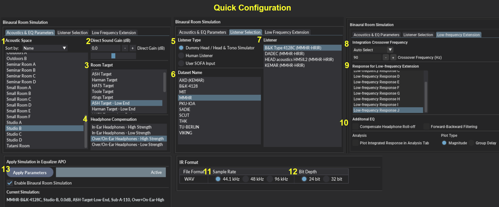

**A Windows distribution of this project is available here: [https://sourceforge.net/projects/ash-toolset/](https://sourceforge.net/projects/ash-toolset/)**

***

### Table of Contents
1. [Features](#Features)
2. [Background](#Background)
3. [Getting Started](#Getting-Started)
4. [Usage](#Usage)
5. [Supporting Information](#Supporting-Information)
6. [License](#License)
7. [Contact](#Contact)
8. [Acknowledgments](#Acknowledgments)

# ASH Toolset
The Audio Spatialisation for Headphones Toolset is a set of tools for headphone correction and binaural synthesis of spatial audio systems on headphones


## Features <a name="Features"></a> 
- **Headphone Correction** — Generate headphone correction filters in WAV format for IR convolution or as configurations for graphic equalisers.
- **Binaural Room Simulation** —  Generate customised binaural simulations of different acoustic environments including control rooms, studios, halls, and more. Resulting filters can be saved in WAV format or SOFA format for IR convolution.
- **Equalizer APO Integration** —  Auto configures Equalizer APO to apply created filters and perform headphone correction and binaural room simulation.
- **HeSuVi Compatibility** —  Generates filters in formats compatible with HeSuVi, a headphone surround virtualization tool for Equalizer APO.
- **SOFA Format Compatibility** - Load HRTF datasets and export customised binaural responses in SOFA format

---
## Background <a name="Background"></a> 

#### Binaural Room Impulse Responses
Binaural room impulse responses (BRIRs) are measurements that capture the spectral filtering properties of the head and ears, as well as the loudspeakers and any room reverberation present. Measurements are typically made in reverberant rooms using dummy heads that are rotated above their torso to capture multiple head orientations for a number of source locations within the room. One key application of BRIRs is the synthesis of spatial audio over headphones. Convolution of an audio signal with a BRIR converts the audio to that which would be heard by the listener if it had been played at the source location. This process can be repeated for all channels in the audio signal and their respective source locations in the room to create spatial surround sound on headphones.

ASH Toolset can be used to generate and apply sets of BRIRs that can be customised to achieve a desired acoustic simulation over headphones. Distance, acoustic environment, listener, headphone type and room target response can be customised to the user's preference.

#### Headphone Correction Filters
A significant source of spectral colouration impacting the quality of binaural simulations is the headphones used for binaural reproduction. A common design goal for headphone calibration is the diffuse-field target which minimises spectral colouration of stereo signals on headphones. Binaural measurements that have been diffuse-field calibrated will be compatible with these types of headphones. As the binaural responses produced by the toolset are diffuse-field calibrated (prior to applying room targets), headphones should also be diffuse-field equalised to ensure compatibility in terms of timbral quality. 

Although diffuse-field calibrated headphones are common, differences in frequency responses across headphones are considerably large. Individual headphone equalisation is therefore recommended to compensate for the unique and undesired spectral colouration introduced by the listener's headphones.  

ASH Toolset can be used to generate and apply Headphone Correction Filters (HpCFs) for a wide range of headphones. The filters can be used to equalise individual headphones to the diffuse-field target response and remove undesired spectral colouration introduced by the headphones.


---
## Getting Started (Python Distribution) <a name="Getting-Started"></a> 

ASH Toolset is a python app built with Python, Numpy, Scipy, & DearPyGui.\
Developed on Python 3.11.7.\
Tested on Windows 10 and Windows 11 with Equalizer APO 1.4 and Voicemeeter 1.1.1.8. Also tested on Ubuntu 24.04.3 LTS.

### Prerequisites

All required dependencies are defined in `requirements.txt`.

Required libraries:

    dearpygui==2.1.0
    dearpygui_ext==2.0.0
    dearpygui_extend==0.1.5
    h5py==3.11.0
    librosa==0.10.2.post1
    mat73==0.63
    matplotlib==3.7.0
    noisereduce==3.0.2
    numpy==2.3.4
    pandas==2.2.3
    platformdirs==4.5.0
    rapidfuzz==3.9.3
    pyfar==0.6.5
    Requests==2.32.5
    scipy==1.11.4
    sofar==1.1.3
    SOFASonix==1.0.7
    sounddevice==0.5.3
    
Data files:

Various HRIR, BRIR and filter datasets are required in the data folder for the app to run. 
- ~~Due to large file sizes the data files need to be retrieved from the google drive folder. 
[Link to data folder](https://drive.google.com/drive/folders/1Yp3NQoxPji8y_DrR8azFvbteml8pTscJ?usp=drive_link).~~ 
- 28/10/2025 update: The required data files are now included in the repository by default. The files are also mirrored in the google drive folder as a backup.

Optional:
- [Equalizer APO](https://sourceforge.net/projects/equalizerapo/), an audio processing object for windows featuring IR convolution and Graphic EQ capabilities.
- [HeSuVi](https://sourceforge.net/projects/hesuvi/), a headphone surround virtualization tool for Equalizer APO.

  
### Installation (Python Distribution) 


1. **Get the ASH Toolset code and data**
    - Either **clone the repository**:
    ```bash
    git clone https://github.com/ShanonPearce/ASH-Toolset.git
    ```
    - Or **download it as a ZIP** from GitHub and extract it anywhere you like.

2. **Install dependencies**

   Run the following in the project root:
    ```bash
    pip install -r requirements.txt
    ```

3. (Optional) **Equalizer APO Setup**

   If you plan to use **Equalizer APO** for system-wide processing:
    - Download it from [Equalizer APO on SourceForge](http://sourceforge.net/projects/equalizerapo).
    - Follow the official [installation tutorial](https://sourceforge.net/p/equalizerapo/wiki/Documentation/#installation-tutorial).

4. (Optional) **Download data files**
    - The `data/` folder is now included in the repository by default.
    - If any data files are **missing or corrupted**, you can download them from Google Drive:
      [Link to data folder](https://drive.google.com/drive/folders/1Yp3NQoxPji8y_DrR8azFvbteml8pTscJ?usp=drive_link)
    - Extract the downloaded `data` folder into the project root so the structure looks like:
      ```
      ASH-Toolset/
      └─ data/
      ```

---
## Usage <a name="Usage"></a> 

Run the ash_toolset.py using python to launch the GUI
```sh
python C:\sample-location\ASH-Toolset\ash_toolset.py
```

### GUI Overview
#### Headphone Correction & Spatial Audio tab:
* Directly apply headphone correction and binaural room simulation in Equalizer APO.
* Exports filters to the Equalizer APO config directory and auto-configures 'config.txt' for convolution.
* Export headphone correction filters and binaural simulation datasets to a local directory.
* Outputs can be used to create spatial surround sound by convolving audio with BRIRs and HpCFs.
* Requires convolution software that supports stereo, true stereo, or multichannel processing.

#### Acoustic Space Import Tool tab:
* Import acoustic impulse response files as new binaural acoustic spaces.

#### Room Target Tool tab:
* Create customised room target responses.

#### Advanced Settings & Maintenance tab:
* Contains advanced options and log messages.

### Headphone Correction
The supplied headphone correction filters can be used to equalise individual headphones to the diffuse-field target response and remove undesired spectral colouration introduced by the headphones.
Filters can be applied directly in Equalizer APO via the Quick Configuration tab or exported as files via the Filter Export tab so they can be used in other audio software.


Steps for selecting and applying/exporting a headphone correction filter:
1. Choose a headphone database.
	- "ASH Filters" contains the main set of filters with a Brand / Headphone / Sample structure.
	- "Compilation" contains additional filters gathered from various measurement datasets with a Type / Headphone / Dataset structure.
2. Select a brand or type to narrow down the headphone list.
3. Select the specific headphone you want to use.
4. Select a sample or dataset.
	- In the Filter and Dataset Export tab, all samples or datasets for that headphone will be exported.
5. (Filter Export tab only) Choose which file types to include in the export:
	- FIR Filters
		* Minimum phase FIR filters in WAV format. Mono.
	- Stereo FIR Filters
		* Minimum phase FIR filters in WAV format. Stereo. Compatible with EasyEffects.
	- Graphic EQ Filters (127 bands)
		* For Equalizer APO and Wavelet.
	- Graphic EQ Filters (31 bands)
		* For 31-band graphic equalizers including Equalizer APO.
	- HeSuVi Filters
		* 127-band graphic EQ format for HeSuVi, saved into the HeSuVi\eq folder.
6. Choose the sample rate for exported WAV files.
	- Options: 44.1 kHz, 48 kHz, 96 kHz.
	- Should match the sample rate of the playback device.
7. Choose the bit depth for exported WAV files.
	- Options: 24 bit, 32 bit.
8. Apply or export the selected filters.
	- "Quick Config - Equalizer APO" loads the filter into Equalizer APO.
	- "Filter Export" exports filter files to the output folder.
	- Default output location: C:\Program Files\EqualizerAPO\config\ASH-Outputs
	- This folder can be changed using the change directory option.


---
### Binaural Room Simulation over Headphones
Binaural room simulation applies a customised acoustic environment to headphones. 
Filters can be applied directly in Equalizer APO via the Quick Configuration tab or exported as WAV/SOFA datasets via the Simulation Export tab so they can be used in other audio software.



Steps for customising and applying/exporting a new simulation:
1. Select Acoustic Space
	- Choose from various environments (audio labs, conference rooms, control rooms, seminar rooms, studios, etc.) 
	- Results in recreations of real acoustic environments derived from real world measurements.
	- Details can be found in the reference tables tab.
	- To disable reverberation, select 'Anechoic Chamber'.
2. Select Gain for Direct Sound (dB)
	- Range: -10 dB to 10 dB.
	- Higher values decrease perceived distance; lower values increase it.
3. Select Listener Type
	- Options:
		* Dummy Head / Head & Torso Simulator
		* Human Listener
		* User SOFA Input
		* Favourites
4. Select Dataset
	- Lists public HRTF datasets if Listener Type is Dummy Head or Human Listener.
5. Select Listener
	- Some options require an internet connection for automatic download.
	- User SOFA files must be placed in the user data folder (default: C:\Program Files\ASH Toolset\_internal\data\user\SOFA).
	- Additional SOFA files can be found at the SOFA conventions repository.
	- Preferred listeners can be added to favourites. An averaged listener can also be generated from the favourites.
6. Optional: Direction Misalignment Correction
	- Correct common orientation errors in SOFA datasets.
	- Use this if azimuth or elevation directions appear reversed, rotated, or start from the wrong reference.
	- Refer to the Reference Tables tab for more details.
7. Select Room Target
	- Options: flat, ASH target, Harman target, etc.
	- Influences overall balance of low and high frequencies.
	- Flat is recommended if using other headphone correction sources (e.g., AutoEq).
8. Select Headphone Compensation
	- Match the listener's headphone type. High strength is default. Reduce to low strength or None if localisation or timbre is compromised.
		* In-Ear Headphones, high strength
		* In-Ear Headphones, low strength
		* Over-Ear/On-Ear Headphones, high strength
		* Over-Ear/On-Ear Headphones, low strength
		* None
9. Optional: Low-frequency Integration Crossover Frequency
	- Range: 0 Hz to 150 Hz.
	- Auto Select chooses an optimal value for the selected acoustic space.
	- Tunes integration of cleaner low-frequency response with original room response. Higher values may result in a smoother bass response. Set to 0Hz to disable this feature.
10. Select Low-frequency Response for Extension
	- Select from a set of generalised low frequency binaural responses sourced from a range of real world acoustic measurements.  
	- Provides clean extension and/or replacement of low frequencies due to limited range and varying quality of original measurements. 
	- Compare responses in the reference tables tab. 
11. Optional: Enable Additional EQ
	- Compensate Headphone Roll-off: adds ~4 dB at 20 Hz.
12. Select Sample Rate
	- Options: 44.1 kHz, 48 kHz, 96 kHz.
	- Must match playback device.
13. Select Bit Depth
	- Options: 24 bit, 32 bit.
14. (Quick Config Tab Only) Apply Parameters
	- Click the apply button in the "Quick Config - Equalizer APO" tab to apply the simulation in Equalizer APO.
Simulation Export tab:
15. (Export Tab Only) Select Spatial Resolution
	- Low: Elevation -30 to 30° in 15° steps, Azimuth 0 to 360° in varying steps.
	- Medium: Elevation -45 to 45° in 15° steps, Azimuth 0 to 360°.
	- High: Elevation -50° (WAV) or -60° (SOFA) in 5° steps, Azimuth 0 to 360° in 5° steps.
16. (Export Tab Only) Select which files to export
	- Direction-specific WAV BRIRs: one file per source direction, 2 channels.
	- True Stereo WAV BRIRs: one file, 4 channels (LL, LR, RL, RR). Compatible with EasyEffects.
	- HeSuVi WAV BRIRs: 14 channels, 24/32 bit, 44.1/48 kHz. Directions configurable in HeSuVi tab.
	- 16 Channel WAV BRIRs: FFMPEG-compatible, 16 channels, configurable in HeSuVi tab.
	- SOFA File: BRIR dataset in SOFA format. Convention selectable in Additional Settings.
17. (Export Tab Only) Click the export button to export the binaural dataset to the output folder.


---
### Using the Correction Filters and Binaural Simulations

The outputs can be used to create spatial surround sound on headphones by convolving an audio stream with a set of binaural impulse responses and a headphone correction filter. This requires IR Convolution software that supports stereo or true stereo processing such as Equalizer APO

### Channel Configuration
The audio channels can be configured in the 'E-APO Configuration' and 'Export Configuration' tabs, located on the right side of the main tab.


- Preamplification Control
	* Apply a gain (in dB) to all channels.
	* Auto-Adjust Preamp can automatically prevent clipping or align low/mid frequency levels for consistent comparisons across simulations.
- Estimated Peak Gain Table
	* Displays potential clipping for different input channel configurations.
	* Max. Peak Gain: highest peak across left and right channels.
- Input Audio Channel Configuration
	* Select the input channel setup from a dropdown. The configuration must be supported by your sound device.
- Upmixing Parameters
	* Upmixing from 2.0 stereo to 7.1 is available using two methods:
		- Method A: simple channel duplication.
		- Method B: includes Mid/Side channel separation.
	* Side/Rear Delay: delay applied to side and rear channels to maintain proper timing in the spatial layout.
- Individual Channel Settings. Each channel (e.g., L, R, C+SUB, SL, SR, RL, RR) can be:
	* Muted/unmuted.
	* Adjusted for gain (dB).
	* Assigned an elevation angle (°) for vertical positioning. Positive values are above the listener while negative values are below the listener.
	* Assigned an azimuth angle (°) for horizontal positioning. Positive values are to the right of the listener while negative values are to the left.
	* These settings control how the audio is spatialised in the binaural simulation.


### 7.1 Surround Virtualisation

If your audio device does not support a 7.1 surround channel configuration, a virtual audio device such as [VB-Audio Virtual Cable](https://www.vb-audio.com/Cable/index.htm) or [Voicemeeter](https://www.vb-audio.com/Voicemeeter/index.htm) can be used for audio processing in place of your regular audio playback device. Equalizer APO can be installed on the virtual audio device which can be configured for 7.1 audio, and the output of the virtual audio device can be sent to your regular audio playback device.

### Apply Filters and Simulations in HeSuVi

As an alternative to above method in Equalizer APO, the generated filters can be applied using HeSuVi.


1. If using HeSuVi for the first time, download [HeSuVi](https://sourceforge.net/projects/hesuvi/) and follow the installation and usage steps outlined in the [HeSuVi Wiki](https://sourceforge.net/p/hesuvi/wiki/Help/).
2. Open or restart HeSuVi
3. The binaural room simulations can be selected in the `Virtualisation` tab. The simulation can be found under the `Common HRIRs` section at the top of the list.
4. The headphone correction filters can be selected in the `Equalizer` tab. The filters can be found under `_HpCFs` at the bottom of the list.

---
### Acoustic Space Import

This tab allows generating new acoustic spaces from reverberant impulse response (IR) files such as room impulse responses (RIRs). Imported spaces can be used in the binaural simulations.

Steps for importing and processing acoustic spaces:
1. Set IR Folder
	- Click 'Open Input Folder' to go to the directory containing IR folders.
	- All IR files for one space must be in a single subfolder (e.g., Room A).
	- Supported file types: .wav, .sofa, .mat, .npy, .hdf5
	- Click 'Refresh Folder List' to update available folders.
	- Select a folder from the IR Folder List dropdown.
2. Enter Metadata (Optional)
	- Name: Name of the acoustic space. If blank, folder name is used.
	- Description: Brief description of the space.
3. Configure IR Processing Options
	- Reverb Tail Mode: Use short mode for spaces with fast decay (< 1.5s). Only enable long mode if IRs have long decay tails (>= 1.5 s) as this will increase processing time. Windowed mode can be used to shorten and fade out long decay trails.
	- Low-frequency Mode: Enable if IRs are low-frequency (subwoofer) measurements. This will make the result available under Low-frequency responses.
	- Binaural measurements: Enable if the IRs are binaural measurements such as dummy head measurements. This will bypass application of new HRTFs to the inputs.
	- Noise Reduction: Enable if IRs contain high noise floor.
	- Rise Time (ms): Duration of fade-in window applied to IR. Min: 1 ms, Max: 20 ms
	- Room Correction Factor: Select a value between 0 and 1 to control the strength of room correction.
	- Listener: Controls which listener will be used to apply binaural transformations. If set to 'User Selection', the current listener selection in the first tab will be used. Not applicable when binaural measurements option is enabled.
4. Set Spatial Sampling and Configuration
	- Spherical Grid Density: Total number of discrete points (directions) on the spherical measurement grid. Range: 192 - 768 points. Not applicable for binaural measurements.
	- Virtual Speaker Count: Number of independent speaker locations to simulate (e.g., 2 for Stereo, 5 for 5.1). Range: 1 - 24.
	- IR Distribution Mode: Determines how measurements are assigned to virtual sources.
		* Sequential: Distributes blocks of neighboring measurements.
		* Round-Robin: Distributes measurements in a fixed circular order.
		* Random: Shuffles measurements for a diffuse spatial feel.
		* Single: Assigns exactly one measurement (or L/R pair) to each virtual speaker.
	- Alignment Frequency (Hz): Cutoff frequency for time-domain alignment.
		* Minimum: 50, Maximum: 150
5. (Optional) Configure Dataset Expansion and Correction
	- Spatial Expansion Method: Expands sparse datasets to increase spatial resolution and density. Not applicable for binaural measurements.
	- Pitch Shift Range: Maximum pitch shift in semitones (0.0 to 24.0).
	- Pitch Shift Correction: Corrects magnitude response after dataset expansion.
	- Decay Curve Correction: Restores direct-to-reverberation ratios to original levels after expansion.
6. (Optional) Configure Room Geometry
	- Room Corner Angle (degrees): Defines the angle to the front-left and front-right corners. 45 degrees is square; 60 degrees is wide and shallow; 30 degrees is narrow and deep.
	- Reflection Spread: Controls the focus of corner reflections. Low (5 - 15): Sharp, pinpoint corners. Medium (20 - 45): Balanced, natural room feel. High (60+): Diffuse, scattered reflections.
7. Start Processing
	- Click 'Start Processing' to begin.
	- Processing time depends on dataset size, tail mode, and expansion settings.

---
### Room Target Generator

This tab can be used to create custom room target curves using low-shelf and high-shelf filters. These targets can be used later in the binaural simulations.

**Enter Target Name (Optional)**
- **Name:** Provide a name for your new room target.
  - If left blank, a name will be auto-generated based on the filter parameters.

**Configure Low-Shelf Filter**
- **Frequency (Hz):**  
  Set the cutoff frequency for the low-shelf filter.  
  - Range: `20–1000 Hz` (default: `100 Hz`)
- **Gain (dB):**  
  Set the gain.  
  - Negative values attenuate low frequencies.  
  - Range: `-6.0 to 18.0 dB` (default: `6.0 dB`)
- **Q-Factor:**  
  Controls the slope of the filter.  
  - Lower values = broader curve.  
  - Range: `0.1 to 5.0` (default: `0.707`)

**Configure High-Shelf Filter**
- **Frequency (Hz):**  
  Set the cutoff frequency for the high-shelf filter.  
  - Range: `1000–20000 Hz` (default: `7000 Hz`)
- **Gain (dB):**  
  Set the gain.  
  - Positive values boost high frequencies.  
  - Range: `-18.0 to 6.0 dB` (default: `-4.0 dB`)
- **Q-Factor:**  
  Controls the slope of the filter.  
  - Lower values = broader curve.  
  - Range: `0.1 to 5.0` (default: `0.4`)

**Generate the Room Target**
- The **Room Target Name** will be displayed below if entered.
- Click **“Generate Target”** to apply your filter settings.
  - The new target will be saved and made available in the **Quick Config** and **Dataset Export** tabs.

---
### File Naming and Structure
By default, outputs (excluding HeSuVi files) are saved within the `ASH-Outputs` folder inside the output directory.  
  * In Quick Configuration, the default path is `C:\Program Files\EqualizerAPO\config\ASH-Outputs`. This is to ensure Equalizer APO can read the filters. 
  * In Filter & Dataset Export, the output directory can be customised using the directory selector.
  * HeSuVi files are saved in the HeSuVi folder (e.g., `C:\Program Files\EqualizerAPO\config\HeSuVi`) by default to ensure compatibility with HeSuVi.

**Binaural Room Impulse Responses**
- BRIRs are saved within the `ASH-Outputs\BRIRs` folder.  
- A separate folder is created for each binaural dataset, named according to the selected parameters:
    (Acoustic_Space)_(Direct_Sound_Gain)_(Listener)_(Room_Target)_(Headphone_Type)_(Low-Freq_Response)
- If Direction-specific export enabled, Individual WAV files are generated for a range of source directions around the listener. Each file corresponds to a unique direction:
    - Naming convention: `BRIR_E(Elevation)_A(Azimuth).wav`
    - Positive elevation: above the listener; negative: below. Zero: same level as listener.
    - Positive azimuth: to the right of the listener; negative: to the left. Azimuth -90°: directly left; 90°: directly right.
- If True Stereo export enabled, a true stereo WAV is also included in each folder: `BRIR_True_Stereo.wav`
- If 16 Channel export enabled, a 16 Channel WAV is also included in each folder prefixed with `BRIR_16ch_`.
- If SOFA export enabled, a corresponding SOFA file is saved under the `SOFA` folder. Refer to reference tables tab for SOFA convention information.

**Headphone Correction Filters**
- Correction filters are saved within the ASH-Outputs\HpCFs folder
- A folder is created for each filter type (FIRs, FIRs_Stereo, Graphic_EQ_31_band, Graphic_EQ_127_band) and for each headphone brand/type that has an exported filter
- The filters are named as per the headphone name


---
## Supporting Information <a name="Supporting-Information"></a> 

### Supported SOFA Conventions

| Convention          | Version | SOFAConventionsVersion | Read | Write |
| ------------------- | ------- | ---------------------- | ---- | ----- |
| GeneralFIR          | 2.1     | 1                      | Yes  | No    |
| GeneralFIR          | 1       | 1                      | Yes  | Yes   |
| SimpleFreeFieldHRIR | 2.1     | 1                      | Yes  | No    |
| SimpleFreeFieldHRIR | 1       | 1                      | Yes  | Yes   |
| SimpleFreeFieldHRIR | 0.6     | 0.4                    | Yes  | No    |
| SimpleFreeFieldHRIR | 0.5     | 0.3                    | Yes  | No    |
| GeneralFIRE         | 1       | 1                      | Yes  | No    |
| GeneralFIRE         | 0.6     | 0.1                    | Yes  | No    |
| GeneralFIR-E        | 2.1     | 2                      | Yes  | No    |
| FreeFieldHRIR       | 2.1     | 1                      | Yes  | No    |


---
## License <a name="License"></a> 
ASH-Toolset is distributed under the terms of the GNU Affero General Public License v3.0 (AGPL-3.0). A copy of this license is provided in the file LICENSE.

## Contact <a name="Contact"></a> 

Shanon Pearce - srpearce55@gmail.com

Project Link: [https://github.com/ShanonPearce/ASH-Toolset](https://github.com/ShanonPearce/ASH-Toolset)

Distribution: [https://sourceforge.net/projects/ash-toolset/](https://sourceforge.net/projects/ash-toolset/)

## Acknowledgments <a name="Acknowledgments"></a> 

### Libraries
* [DearPyGui](https://github.com/hoffstadt/DearPyGui/tree/master)
* [DearPyGui Ext](https://github.com/hoffstadt/DearPyGui_Ext)
* [DearPyGui Extend](https://github.com/fabriciochamon/DearPyGui_Extend)
* [numpy](https://numpy.org/)
* [scipy](https://scipy.org/)

### Datasets
This project makes use of various publicly available HRTF, RIR, and BRIR datasets. Refer to the sheets provided in the `ASH-Toolset\docs` folder for information on the raw datasets used in this project. Further information on the HRTF datasets can be found at the [SOFA conventions repository](https://www.sofaconventions.org/mediawiki/index.php/Files).  
