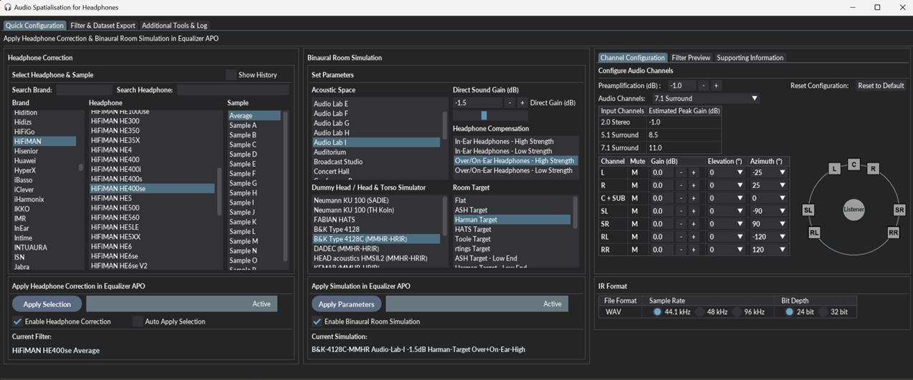
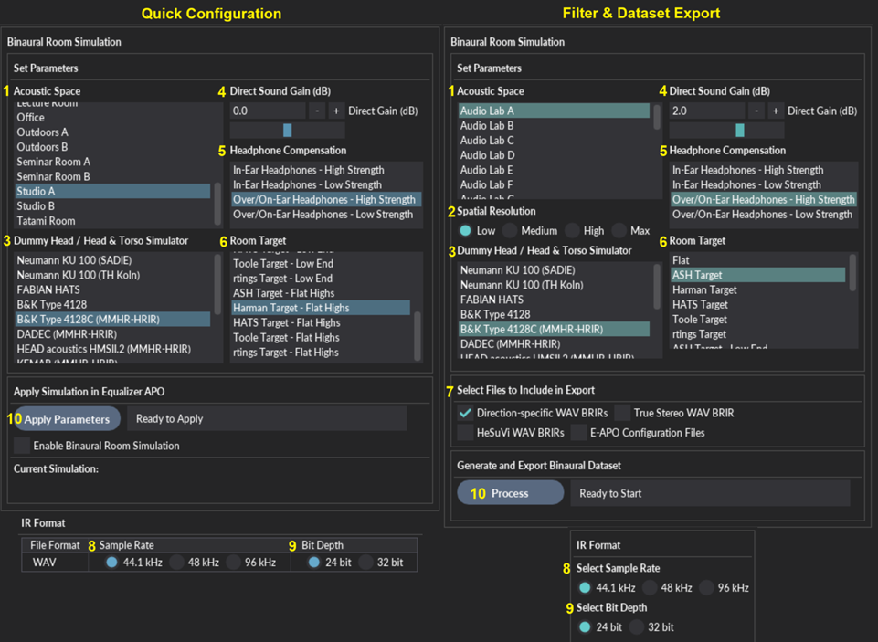

**A Windows distribution of this project is available here: [https://sourceforge.net/projects/ash-toolset/](https://sourceforge.net/projects/ash-toolset/)**

***

### Table of Contents
1. [Features](#Features)
2. [Background](#Background)
3. [Getting Started](#Getting-Started)
4. [Usage](#Usage)
5. [License](#License)
6. [Contact](#Contact)
7. [Acknowledgments](#Acknowledgments)

# ASH Toolset
The Audio Spatialisation for Headphones Toolset is a set of tools for headphone correction and binaural synthesis of spatial audio systems on headphones



## Features <a name="Features"></a> 
- **Headphone Correction** — Generate Headphone correction filters (HpCFs) in WAV format for IR convolution or configurations for graphic equalisers
- **Binaural Room Simulation** —  Generate customised Binaural Room Impulse Responses (BRIRs) in WAV format for IR convolution
- **Equalizer APO Compatibility** —  Generates configuration files to load HpCFs and BRIRs in Equalizer APO, an audio processing object for windows.
- **HeSuVi Compatibility** —  Generates BRIRs and HpCFs in formats compatible with HeSuVi, a headphone surround virtualization tool for Equalizer APO.

## Background <a name="Background"></a> 

### Binaural Room Impulse Responses
Binaural room impulse responses (BRIRs) are measurements that capture the spectral filtering properties of the head and ears, as well as the loudspeakers and any room reverberation present. Measurements are typically made in reverberant rooms using dummy heads that are rotated above their torso to capture multiple head orientations for a number of source locations within the room. One key application of BRIRs is the synthesis of spatial audio over headphones. Convolution of an audio signal with a BRIR converts the audio to that which would be heard by the listener if it had been played at the source location. This process can be repeated for all channels in the audio signal and their respective source locations in the room to create spatial surround sound on headphones.

The ASH Toolset can be used to generate BRIRs that can be customised to achieve a desired acoustic simulation over headphones. Distance, reverberation time, listener, headphone type and room target response can be customised to the user's preference.

### Headphone Correction Filters

A significant source of spectral colouration impacting the quality of binaural simulations is the headphones used for binaural reproduction. A common design goal for headphone calibration is the diffuse-field target which minimises spectral colouration of stereo signals on headphones. Binaural measurements that have been diffuse-field calibrated will be compatible with these types of headphones. As the binaural responses produced by the toolset are diffuse-field calibrated (prior to applying room targets), headphones should also be diffuse-field equalised to ensure compatibility in terms of timbral quality. 

Although diffuse-field calibrated headphones are common, differences in frequency responses across headphones are considerably large. Individual headphone equalisation is therefore recommended to compensate for the unique and undesired spectral colouration introduced by the listener's headphones.  

The ASH Toolset can be used to generate Headphone Correction Filters (HpCFs) for a set of commonly used headphones. The filters can be used to equalise individual headphones to the diffuse-field target response and remove undesired spectral colouration introduced by the headphones.


## Getting Started <a name="Getting-Started"></a> 

ASH Toolset is a python app built with Python, Numpy, Scipy, & DearPyGui.\
Developed on Python 3.11.7.\
Tested on Windows 10 and Windows 11.

### Prerequisites

Python libraries:
  ```sh
  pip install dearpygui
  pip install dearpygui_ext
  pip install dearpygui-extend
  pip install mat73
  pip install matplotlib
  pip install numpy
  pip install pyfar
  pip install scipy
  pip install soundfile
  pip install gdown
  ```
Data files:

HRIR, BRIR and filter datasets are required in the data folder to run the app. Due to large file sizes the data files are stored using google drive.\
[Link to data folder](https://drive.google.com/drive/folders/1Yp3NQoxPji8y_DrR8azFvbteml8pTscJ?usp=drive_link)

Optional:
- [Equalizer APO](https://sourceforge.net/projects/equalizerapo/), an audio processing object for windows featuring IR convolution and Graphic EQ capabilities.
- [HeSuVi](https://sourceforge.net/projects/hesuvi/), a headphone surround virtualization tool for Equalizer APO.

  
### Installation

1. Clone the repo
2. Download the data folder from google drive
3. Extract data folder to ASH-Toolset root folder
4. (optional) If using Equalizer APO for the first time, download [Equalizer APO](http://sourceforge.net/projects/equalizerapo) and follow the Equalizer APO [installation tutorial](https://sourceforge.net/p/equalizerapo/wiki/Documentation/#installation-tutorial). 


## Usage <a name="Usage"></a> 

Run the ash_toolset.py using python to launch the GUI
```sh
python C:\sample-location\ASH-Toolset\ash_toolset.py
```

### Generate HpCFs for headphone correction
This part of the app is used to generate a set of HpCFs for a selected headphone and export to files which can then be loaded into audio processing software to apply headphone correction.
1. Select a headphone brand to filter down on the headphone list
2. Select a specific headphone
3. One or more samples will be available for the specified headphone. Select one to preview the filter response. Note that all samples will be exported for the selected headphone.
4. Select which files to include in the export
   - FIR Filters: Minimum phase WAV FIRs for convolution. 1 Channel, 24 bit depth, 44.1Khz
   - stereo FIR Filters: Minimum phase WAV FIRs for convolution. 2 Channels, 24 bit depth, 44.1Khz
   - E-APO Configuration files: configuration files that can be loaded into Equalizer APO to perform convolution with FIR filters
   - Graphic EQ Filters: Graphic EQ configurations with 127 bands. Compatible with Equalizer APO and Wavelet
   - Graphic EQ Filters (31 bands): Graphic EQ configurations with 31 bands. Compatible with 31 band graphic equalizers including Equalizer APO
   - HeSuVi Filters: Graphic EQ configurations with 127 bands. Compatible with HeSuVi. Saved in HeSuVi\eq folder
5. Select a location to export files to. Default location is in the Equalizer APO config directory (e.g. C:\Program Files\EqualizerAPO\config\ASH-Custom-Set), which is the recommended location if using Equalizer APO. HeSuVi files will be saved in the EqualizerAPO\config\HeSuVi directory.
6. Click the process HpCFs button to export the selected HpCFs to above directory


### Generate BRIRs for binaural room simulation
This part of the app is used to generate a set of customised BRIRs and export to WAV files which can then be loaded into audio processing software to apply binaural room simulation.
1. Select Gain for Direct Sound in dB. Select a value between -8dB and 8dB. Higher values will result in lower perceived distance. Lower values result in higher perceived distance
2. Select Target RT60 Reverberation Time in ms. Select a value between 200ms and 1250ms. Higher values will result in more late reflections and larger perceived space.
3. Select Dummy Head / Head & Torso Simulator from available options:
   - KU_100
   - KEMAR_Large
   - KEMAR_Normal
   - B&K_4128
   - DADEC
   - HMSII.2
   - KEMAR
   - B&K_4128C
5. Select Headphone Type from options:
   - In-Ear Headphones
   - Over-Ear/On-Ear Headphones
6. Select Room Target from available options:
   - Flat
   - ASH Target
   - Harman Target
   - HATS Target
   - Toole Target
   - rtings Target
7. Select which files to include in the export
   - Direction specific WAVs: Directional WAV BRIRs for convolution. 2 Channels, 24 bit depth, 44.1Khz
   - True Stereo WAVs: True Stereo WAV BRIRs for convolution. 4 Channels (LL LR RL RR), 24 bit depth, 44.1Khz
   - HeSuVi WAVs: HeSuVi compatible WAV BRIRs. 14 Channels, 24 bit depth, 44.1Khz and 48Khz
   - E-APO Configuration Files: configuration files that can be loaded into Equalizer APO to perform convolution with BRIRs
8. Select a location to export files to. Default location is in the Equalizer APO config directory (e.g. C:\Program Files\EqualizerAPO\config\ASH-Custom-Set), which is the recommended location if using Equalizer APO. HeSuVi files will be saved in the EqualizerAPO\config\HeSuVi directory.
9. Click the process BRIRs button to generate and export the customised BRIRs to above directory. This may take a minute to run.



### Using the BRIRs and HpCFs

The outputs can be used to create spatial surround sound on headphones by convolving an audio stream with a set of BRIRs and a HpCF. This requires IR Convolution software that supports stereo or true stereo processing such as Equalizer APO

### Apply HpCFs and BRIRs in Equalizer APO

1. Set your sound device's default format to 44100Hz under the properties of your playback device. In Windows 10 the playback device settings can be found in Settings -> System -> Sound -> Sound control panel.
2. HpCFs and BRIRs will be saved in the Equalizer APO config directory (e.g. C:\Program Files\EqualizerAPO\config\ASH-Custom-Set) by default. Move the ASH-Custom-Set folder to this location if it was saved elsewhere.
3. In the configuration editor, add a new `Include` command to your `config.txt` file, then navigate to the `EqualizerAPO\config\ASH-Custom-Set\E-APO-Configs\HpCF-Convolution` folder and select the desired configuration file for headphone correction.
4. In the configuration editor, add a new `Include` command to your `config.txt` file, then navigate to the `EqualizerAPO\config\ASH-Custom-Set\E-APO-Configs\BRIR-Convolution` folder and select the desired configuration file for binaural room simulation.
5. To swap out a HpCF or BRIR, simply load a different configuration file.


**7.1 Surround Virtualisation**

If your audio device does not support a 7.1 surround channel configuration, a virtual audio device such as [VB-Audio Virtual Cable](https://www.vb-audio.com/Cable/index.htm) or [Voicemeeter](https://www.vb-audio.com/Voicemeeter/index.htm) can be used for audio processing in place of your regular audio playback device. Equalizer APO can be installed on the virtual audio device which can be configured for 7.1 audio, and the output of the virtual audio device can be sent to your regular audio playback device.

### Apply HpCFs and BRIRs in HeSuVi

As an alternative to above method in Equalizer APO, the HpCFs and BRIRs can be applied using HeSuVi.

1. If using HeSuVi for the first time, download [HeSuVi](https://sourceforge.net/projects/hesuvi/) and follow the installation and usage steps outlined in the [HeSuVi Wiki](https://sourceforge.net/p/hesuvi/wiki/Help/).
2. Open or restart HeSuVi
3. The BRIRs can be selected in the `Virtualisation` tab. The rooms can be found under the `Common HRIRs` section at the top of the list.
4. The HpCFs can be selected in the `Equalizer` tab. The HpCFs can be found under `_HpCFs` at the bottom of the list.


### File naming and Structure
Outputs are saved within the ASH-Custom-Set child folder under the selected directory. This will be in the Equalizer APO config directory (e.g. C:\Program Files\EqualizerAPO\config\ASH-Custom-Set) by default. HeSuVi files however will be saved within the HeSuVi folder (e.g. C:\Program Files\EqualizerAPO\config\HeSuVi) if the selected output directory is the Equalizer APO config directory.

**BRIRs**
- BRIRs are saved within the ASH-Custom-Set\BRIRs folder.
- A folder is created for each set of BRIRs and is named as per the selected parameters.
    - The naming convention for the folder is `(Listener)_(Reverb_Time)_(Direct_Sound_Gain)_(Room_Target)_(Headphone_Type)`.
- A WAV file is created for a range of source directions around the listener. Each WAV file corresponds to a unique direction.
    - The naming convention for the BRIR WAV files is `BRIR_E(Elevation)_A(Azimuth).wav`.
    - Positive elevation angles correspond to points above the listener while negative angles correspond to points below the listener. An elevation of 0 corresponds to a point at the same level as the listener.
    - Positive azimuth angles correspond to points to the right of the listener while negative angles correspond to points to the left of the listener. An azimuth of -90 corresponds to a point directly to the left of the listener while an azimuth of 90 corresponds to a point directly to the right of the listener.
- A true stereo WAV file is also located in each folder with naming `BRIR_True_Stereo.wav`

**HpCFs**
- HpCFs are saved within the ASH-Custom-Set\HpCFs folder
- A folder is created for each filter type and for each headphone brand that has an exported filter
- The filters are named as per the headphone name

**Equalizer APO Configurations**
- Equalizer APO configurations are saved within the ASH-Custom-Set\E-APO-Configs folder
- Folders follow the same naming as the BRIRs and HpCFs
- A set of BRIR convolution configuration files are created for a range of common speaker configurations including Stereo, 5.1 surround, & 7.1 surround.
- A set of HpCF convolution configuration files are created for each HpCF that was exported


## License <a name="License"></a> 
ASH-Toolset is distributed under the terms of the GNU Affero General Public License v3.0 (AGPL-3.0). A copy of this license is provided in the file LICENSE.

## Contact <a name="Contact"></a> 

Shanon Pearce - srpearce55@gmail.com

Project Link: [https://github.com/ShanonPearce/ASH-Toolset](https://github.com/ShanonPearce/ASH-Toolset)

Distribution: [https://sourceforge.net/projects/ash-toolset/](https://sourceforge.net/projects/ash-toolset/)

## Acknowledgments <a name="Acknowledgments"></a> 

### Libraries
* [DearPyGui](https://github.com/hoffstadt/DearPyGui/tree/master)
* [DearPyGui Ext](https://github.com/hoffstadt/DearPyGui_Ext)
* [DearPyGui Extend](https://github.com/fabriciochamon/DearPyGui_Extend)
* [numpy](https://numpy.org/)
* [scipy](https://scipy.org/)

### Datasets
This project makes use of various publically available HRIR and BRIR datasets. Refer to the sheets provided in the `ASH-Toolset\docs` folder for information on the raw datasets used in this project
