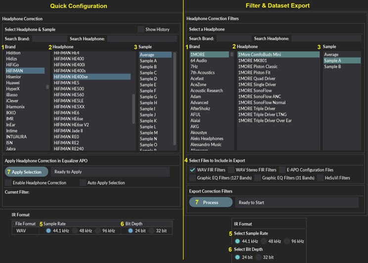

**[Download Latest Windows Release](https://sourceforge.net/projects/ash-toolset/)**

**[Source Code](https://github.com/ShanonPearce/ASH-Toolset)**

The Audio Spatialisation for Headphones Toolset is a set of tools for headphone correction and binaural synthesis of spatial audio systems on headphones.

## Features  
- **Headphone Correction** — Generate headphone correction filters in WAV format for IR convolution or as configurations for graphic equalisers.
- **Binaural Room Simulation** —  Generate customised binaural simulations of different acoustic environments including control rooms, studios, halls, and more. Resulting filters can be saved in WAV format or SOFA format for IR convolution.
- **Equalizer APO Integration** —  Auto configures Equalizer APO to apply created filters and perform headphone correction and binaural room simulation.
- **HeSuVi Compatibility** —  Generates filters in formats compatible with HeSuVi, a headphone surround virtualization tool for Equalizer APO.
- **SOFA Format Compatibility** - Load HRTF datasets and export customised binaural responses in SOFA format

---
## Windows Installation  

1.  Download the [latest release](https://sourceforge.net/projects/ash-toolset/) and run the installer or download the portable package and unzip to the location of your choice.
2.  When running the executable, if a Microsoft Defender Smartscreen warning is presented, click 'More info' and 'Run anyway'. This warning may show on some releases due to the code signing certificate of the executable building reputation.
3.  (optional) If using Equalizer APO for audio processing, download [Equalizer APO](http://sourceforge.net/projects/equalizerapo) and follow the Equalizer APO [installation tutorial](https://sourceforge.net/p/equalizerapo/wiki/Documentation/#installation-tutorial). 
4.  (optional) If using HeSuVi for audio processing, download [HeSuVi](https://sourceforge.net/projects/hesuvi/) and follow the installation and usage steps outlined in the [HeSuVi Wiki](https://sourceforge.net/p/hesuvi/wiki/Help/).

---
## Usage  

Run the application as administrator to launch the GUI. It may take a few seconds for it to launch.

### GUI Overview
#### Headphone Correction & Spatial Audio tab:
* Directly apply headphone correction and binaural room simulation in Equalizer APO.
* Exports filters to the Equalizer APO config directory and auto-configures 'config.txt' for convolution.
* Export headphone correction filters and binaural simulation datasets to a local directory.
* Outputs can be used to create spatial surround sound by convolving audio with BRIRs and HpCFs.
* Requires convolution software that supports stereo, true stereo, or multichannel processing.

#### Acoustic Space Import Tool tab:
* Import acoustic impulse response files as new binaural acoustic spaces.

#### Room Target Tool tab:
* Create customised room target responses.

#### Advanced Settings & Maintenance tab:
* Contains advanced options and log messages.

### Headphone Correction
The supplied headphone correction filters can be used to equalise individual headphones to the diffuse-field target response and remove undesired spectral colouration introduced by the headphones.
Filters can be applied directly in Equalizer APO via the Quick Configuration tab or exported as files via the Filter Export tab so they can be used in other audio software.

Steps for selecting and applying/exporting a headphone correction filter:
1. Choose a headphone database.
	- "ASH Filters" contains the main set of filters with a Brand / Headphone / Sample structure.
	- "Compilation" contains additional filters gathered from various measurement datasets with a Type / Headphone / Dataset structure.
2. Select a brand or type to narrow down the headphone list.
3. Select the specific headphone you want to use.
4. Select a sample or dataset.
	- In the Filter and Dataset Export tab, all samples or datasets for that headphone will be exported.
5. (Filter Export tab only) Choose which file types to include in the export:
	- FIR Filters
		* Minimum phase FIR filters in WAV format. Mono.
	- Stereo FIR Filters
		* Minimum phase FIR filters in WAV format. Stereo. Compatible with EasyEffects.
	- Graphic EQ Filters (127 bands)
		* For Equalizer APO and Wavelet.
	- Graphic EQ Filters (31 bands)
		* For 31-band graphic equalizers including Equalizer APO.
	- HeSuVi Filters
		* 127-band graphic EQ format for HeSuVi, saved into the HeSuVi\eq folder.
6. Choose the sample rate for exported WAV files.
	- Options: 44.1 kHz, 48 kHz, 96 kHz.
	- Should match the sample rate of the playback device.
7. Choose the bit depth for exported WAV files.
	- Options: 24 bit, 32 bit.
8. Apply or export the selected filters.
	- "Quick Config - Equalizer APO" loads the filter into Equalizer APO.
	- "Filter Export" exports filter files to the output folder.
	- Default output location: C:\Program Files\EqualizerAPO\config\ASH-Outputs
	- This folder can be changed using the change directory option.

---
###  Binaural Room Simulation over Headphones
Binaural room simulation applies a customised acoustic environment to headphones. 
Filters can be applied directly in Equalizer APO via the Quick Configuration tab or exported as WAV/SOFA datasets via the Simulation Export tab so they can be used in other audio software.

Steps for customising and applying/exporting a new simulation:
1. Select Acoustic Space
	- Choose from various environments (audio labs, conference rooms, control rooms, seminar rooms, studios, etc.) 
	- Results in recreations of real acoustic environments derived from real world measurements.
	- Details can be found in the reference tables tab. 
2. Select Gain for Direct Sound (dB)
	- Range: -10 dB to 10 dB.
	- Higher values decrease perceived distance; lower values increase it.
3. Select Listener Type
	- Options:
		* Dummy Head / Head & Torso Simulator
		* Human Listener
		* User SOFA Input
		* Favourites
4. Select Dataset
	- Lists public HRTF datasets if Listener Type is Dummy Head or Human Listener.
5. Select Listener
	- Some options require an internet connection for automatic download.
	- User SOFA files must be placed in the user data folder (default: C:\Program Files\ASH Toolset\_internal\data\user\SOFA).
	- Additional SOFA files can be found at the SOFA conventions repository.
	- Preferred listeners can be added to favourites. An averaged listener can also be generated from the favourites.
6. Optional: Direction Misalignment Correction
	- Correct common orientation errors in SOFA datasets.
	- Use this if azimuth or elevation directions appear reversed, rotated, or start from the wrong reference.
	- Refer to the Reference Tables tab for more details.
7. Select Room Target
	- Options: flat, ASH target, Harman target, etc.
	- Influences overall balance of low and high frequencies.
	- Flat is recommended if using other headphone correction sources (e.g., AutoEq).
8. Select Headphone Compensation
	- Match the listener's headphone type. High strength is default. Reduce to low strength or None if localisation or timbre is compromised.
		* In-Ear Headphones, high strength
		* In-Ear Headphones, low strength
		* Over-Ear/On-Ear Headphones, high strength
		* Over-Ear/On-Ear Headphones, low strength
		* None
9. Optional: Low-frequency Integration Crossover Frequency
	- Range: 0 Hz to 150 Hz.
	- Auto Select chooses an optimal value for the selected acoustic space.
	- Tunes integration of cleaner low-frequency response with original room response. Higher values may result in a smoother bass response. Set to 0Hz to disable this feature.
10. Select Low-frequency Response for Extension
	- Select from a set of generalised low frequency binaural responses sourced from a range of real world acoustic measurements.  
	- Provides clean extension and/or replacement of low frequencies due to limited range and varying quality of original measurements. 
	- Compare responses in the reference tables tab. 
11. Optional: Enable Additional EQ
	- Compensate Headphone Roll-off: adds ~4 dB at 20 Hz.
12. Select Sample Rate
	- Options: 44.1 kHz, 48 kHz, 96 kHz.
	- Must match playback device.
13. Select Bit Depth
	- Options: 24 bit, 32 bit.
14. (Quick Config Tab Only) Apply Parameters
	- Click the apply button in the "Quick Config - Equalizer APO" tab to apply the simulation in Equalizer APO.
Simulation Export tab:
15. (Export Tab Only) Select Spatial Resolution
	- Low: Elevation -30 to 30° in 15° steps, Azimuth 0 to 360° in varying steps.
	- Medium: Elevation -45 to 45° in 15° steps, Azimuth 0 to 360°.
	- High: Elevation -50° (WAV) or -60° (SOFA) in 5° steps, Azimuth 0 to 360° in 5° steps.
16. (Export Tab Only) Select which files to export
	- Direction-specific WAV BRIRs: one file per source direction, 2 channels.
	- True Stereo WAV BRIRs: one file, 4 channels (LL, LR, RL, RR). Compatible with EasyEffects.
	- HeSuVi WAV BRIRs: 14 channels, 24/32 bit, 44.1/48 kHz. Directions configurable in HeSuVi tab.
	- 16 Channel WAV BRIRs: FFMPEG-compatible, 16 channels, configurable in HeSuVi tab.
	- SOFA File: BRIR dataset in SOFA format. Convention selectable in Additional Settings.
17. (Export Tab Only) Click the export button to export the binaural dataset to the output folder.
    
---
### Using the Correction Filters and Binaural Simulations

The outputs can be used to create spatial surround sound on headphones by convolving an audio stream with a set of binaural impulse responses and a headphone correction filter. This requires IR Convolution software that supports stereo or true stereo processing such as Equalizer APO

### Channel Configuration
The audio channels can be configured in the 'E-APO Configuration' and 'Export Configuration' tabs, located on the right side of the main tab.

- Preamplification Control
	* Apply a gain (in dB) to all channels.
	* Auto-Adjust Preamp can automatically prevent clipping or align low/mid frequency levels for consistent comparisons across simulations.
- Estimated Peak Gain Table
	* Displays potential clipping for different input channel configurations.
	* Max. Peak Gain: highest peak across left and right channels.
- Input Audio Channel Configuration
	* Select the input channel setup from a dropdown. The configuration must be supported by your sound device.
- Upmixing Parameters
	* Upmixing from 2.0 stereo to 7.1 is available using two methods:
		- Method A: simple channel duplication.
		- Method B: includes Mid/Side channel separation.
	* Side/Rear Delay: delay applied to side and rear channels to maintain proper timing in the spatial layout.
- Individual Channel Settings. Each channel (e.g., L, R, C+SUB, SL, SR, RL, RR) can be:
	* Muted/unmuted.
	* Adjusted for gain (dB).
	* Assigned an elevation angle (°) for vertical positioning. Positive values are above the listener while negative values are below the listener.
	* Assigned an azimuth angle (°) for horizontal positioning. Positive values are to the right of the listener while negative values are to the left.
	* These settings control how the audio is spatialised in the binaural simulation.

### 7.1 Surround Virtualisation

If your audio device does not support a 7.1 surround channel configuration, a virtual audio device such as [VB-Audio Virtual Cable](https://www.vb-audio.com/Cable/index.htm) or [Voicemeeter](https://www.vb-audio.com/Voicemeeter/index.htm) can be used for audio processing in place of your regular audio playback device. Equalizer APO can be installed on the virtual audio device which can be configured for 7.1 audio, and the output of the virtual audio device can be sent to your regular audio playback device.

### Apply Filters and Simulations in HeSuVi

As an alternative to above method in Equalizer APO, the generated filters can be applied using HeSuVi.

1. If using HeSuVi for the first time, download [HeSuVi](https://sourceforge.net/projects/hesuvi/) and follow the installation and usage steps outlined in the [HeSuVi Wiki](https://sourceforge.net/p/hesuvi/wiki/Help/).
2. Open or restart HeSuVi
3. The binaural room simulations can be selected in the `Virtualisation` tab. The simulation can be found under the `Common HRIRs` section at the top of the list.
4. The headphone correction filters can be selected in the `Equalizer` tab. The filters can be found under `_HpCFs` at the bottom of the list.

---
### Acoustic Space Import

This tab allows generating new acoustic spaces from reverberant impulse response (IR) files such as room impulse responses (RIRs). Imported spaces can be used in the binaural simulations.

Steps for importing and processing acoustic spaces:
1. Set IR Folder
	- Click 'Open Input Folder' to go to the directory containing IR folders.
	- All IR files for one space must be in a single subfolder (e.g., Room A).
	- Supported file types: .wav, .sofa, .mat, .npy, .hdf5
	- Click 'Refresh Folder List' to update available folders.
	- Select a folder from the IR Folder List dropdown.
2. Enter Metadata (Optional)
	- Name: Name of the acoustic space. If blank, folder name is used.
	- Description: Brief description of the space.
3. Configure IR Processing Options
	- Reverb Tail Mode: Use short mode for spaces with fast decay (< 1.5s). Only enable long mode if IRs have long decay tails (>= 1.5 s) as this will increase processing time. Windowed mode can be used to shorten and fade out long decay trails.
	- Low-frequency Mode: Enable if IRs are low-frequency (subwoofer) measurements. This will make the result available under Low-frequency responses.
	- Binaural measurements: Enable if the IRs are binaural measurements such as dummy head measurements. This will bypass application of new HRTFs to the inputs.
	- Noise Reduction: Enable if IRs contain high noise floor.
	- Rise Time (ms): Duration of fade-in window applied to IR. Min: 1 ms, Max: 20 ms
	- Room Correction Factor: Select a value between 0 and 1 to control the strength of room correction.
	- Listener: Controls which listener will be used to apply binaural transformations. If set to 'User Selection', the current listener selection in the first tab will be used. Not applicable when binaural measurements option is enabled.
4. Set Spatial Sampling
	- Desired Directions: Number of simulated source directions to generate.
		* Minimum: 2000, Maximum: 5000
		* Lower values reduce processing time but may also reduce quality.
	- Alignment Frequency (Hz): Cutoff frequency for time-domain alignment.
		* Minimum: 50, Maximum: 150
5. (Optional) Configure Pitch Shifting for Dataset Expansion
	- Pitch Shift Range: Maximum pitch shift in semitones (default: 12.0)
	- Pitch Shift Compensation: Enable to correct frequency response of pitch-shifted IRs.
6. Start Processing
	- Click 'Start Processing' to begin.
	- Processing time depends on dataset size and settings.

---
### Room Target Generator

This tab can be used to create custom room target curves using low-shelf and high-shelf filters. These targets can be used later in the binaural simulations.

**Enter Target Name (Optional)**
- **Name:** Provide a name for your new room target.
  - If left blank, a name will be auto-generated based on the filter parameters.

**Configure Low-Shelf Filter**
- **Frequency (Hz):**  
  Set the cutoff frequency for the low-shelf filter.  
  - Range: `20–1000 Hz` (default: `100 Hz`)
- **Gain (dB):**  
  Set the gain.  
  - Negative values attenuate low frequencies.  
  - Range: `-6.0 to 18.0 dB` (default: `6.0 dB`)
- **Q-Factor:**  
  Controls the slope of the filter.  
  - Lower values = broader curve.  
  - Range: `0.1 to 5.0` (default: `0.707`)

**Configure High-Shelf Filter**
- **Frequency (Hz):**  
  Set the cutoff frequency for the high-shelf filter.  
  - Range: `1000–20000 Hz` (default: `7000 Hz`)
- **Gain (dB):**  
  Set the gain.  
  - Positive values boost high frequencies.  
  - Range: `-18.0 to 6.0 dB` (default: `-4.0 dB`)
- **Q-Factor:**  
  Controls the slope of the filter.  
  - Lower values = broader curve.  
  - Range: `0.1 to 5.0` (default: `0.4`)

**Generate the Room Target**
- The **Room Target Name** will be displayed below if entered.
- Click **“Generate Target”** to apply your filter settings.
  - The new target will be saved and made available in the **Quick Config** and **Dataset Export** tabs.

---
### File Naming and Structure
By default, outputs (excluding HeSuVi files) are saved within the `ASH-Outputs` folder inside the output directory.  
  * In Quick Configuration, the default path is `C:\Program Files\EqualizerAPO\config\ASH-Outputs`. This is to ensure Equalizer APO can read the filters. 
  * In Filter & Dataset Export, the output directory can be customised using the directory selector.
  * HeSuVi files are saved in the HeSuVi folder (e.g., `C:\Program Files\EqualizerAPO\config\HeSuVi`) by default to ensure compatibility with HeSuVi.

**Binaural Room Impulse Responses**
- BRIRs are saved within the `ASH-Outputs\BRIRs` folder.  
- A separate folder is created for each binaural dataset, named according to the selected parameters:
    (Acoustic_Space)_(Direct_Sound_Gain)_(Listener)_(Room_Target)_(Headphone_Type)_(Low-Freq_Response)
- If Direction-specific export enabled, Individual WAV files are generated for a range of source directions around the listener. Each file corresponds to a unique direction:
    - Naming convention: `BRIR_E(Elevation)_A(Azimuth).wav`
    - Positive elevation: above the listener; negative: below. Zero: same level as listener.
    - Positive azimuth: to the right of the listener; negative: to the left. Azimuth -90°: directly left; 90°: directly right.
- If True Stereo export enabled, a true stereo WAV is also included in each folder: `BRIR_True_Stereo.wav`
- If 16 Channel export enabled, a 16 Channel WAV is also included in each folder prefixed with `BRIR_16ch_`.
- If SOFA export enabled, a corresponding SOFA file is saved under the `SOFA` folder. Refer to reference tables tab for SOFA convention information.

**Headphone Correction Filters**
- Correction filters are saved within the ASH-Outputs\HpCFs folder
- A folder is created for each filter type (FIRs, FIRs_Stereo, Graphic_EQ_31_band, Graphic_EQ_127_band) and for each headphone brand/type that has an exported filter
- The filters are named as per the headphone name

---
## Supporting Information  

### Supported SOFA Conventions

| Convention          | Version | SOFAConventionsVersion | Read | Write |
| ------------------- | ------- | ---------------------- | ---- | ----- |
| GeneralFIR          | 2.1     | 1                      | Yes  | No    |
| GeneralFIR          | 1       | 1                      | Yes  | Yes   |
| SimpleFreeFieldHRIR | 2.1     | 1                      | Yes  | No    |
| SimpleFreeFieldHRIR | 1       | 1                      | Yes  | Yes   |
| SimpleFreeFieldHRIR | 0.6     | 0.4                    | Yes  | No    |
| SimpleFreeFieldHRIR | 0.5     | 0.3                    | Yes  | No    |
| GeneralFIRE         | 1       | 1                      | Yes  | No    |
| GeneralFIRE         | 0.6     | 0.1                    | Yes  | No    |
| GeneralFIR-E        | 2.1     | 2                      | Yes  | No    |
| FreeFieldHRIR       | 2.1     | 1                      | Yes  | No    |

---
## Changelog  

Version 4.1.0:
- Added ‘Anechoic Chamber’ option to acoustic spaces to allow for removal of reverberation
- Added ‘Max output length’ option in advanced settings which can be used to force trim/crop the outputs
- Updated acoustic space import tool with more parameters allowing finer control of the spatial transformation.
- Fixed a bug in the acoustic space import tool impacting time domain alignment accuracy
- Added new acoustic spaces including the rooms from ASH Listening Set
- Added new parameters in advanced settings for calibration control
- Added option in advanced settings to clear the cache files including downloaded acoustic spaces and HRTF related data
  
Version 4.0.0:
- Merged Quick Configuration and Filter/Dataset Export into a single tab named “Headphone Correction & Spatial Audio”
- Added a range of new acoustic spaces
- Added new variations of existing acoustic spaces
- Added acoustic space collection filtering dropdown
- Added favourites system for acoustic spaces
- Added basic acoustic space info panel beside space selection
- Moved direction misalignment correction into listener tab. Included common elevation correction options.
- Added new room targets
- Added new low frequency responses
- Added new over-ear and in-ear headphone correction filters
- Added option to apply different headphone targets to correction filters (DF, Harman, etc.)
- Added option to apply high-frequency smoothing above 7 kHz to correction filters
- Added option to acoustic space import tool to select HRIR dataset during import
- Added summary plot mode (integrated response only)
- Added selectable azimuth and elevation for HRTF plots
- Added spatial resolution option to E-APO configuration tab to allow for additional elevations to be selected
- Added option to export SOFA at all spatial resolutions. Previously it was only available when ‘high’ was selected.
- Added revert selection button to revert parameters to previously applied values
- Improved interpolation quality and phase handling
- Improved quality of diffuse-field calibration of HRTF datasets that have sparse spatial grids 
- Fixed issue in acoustic space import tool allowing folder changes while processing
- Fixed issue causing mute selection to be ignored in certain scenarios
- Fixed compatibility issues with linux in the python distribution
- Fixed bug where a change in headphone filter was not applied if selection wasn’t re-applied before 
- Improved SOFA convention compatibility
- Fixed bug causing incorrect headphone filter to be applied in cases where the headphone selection is 
- changed by the user but not yet applied then binaural simulation is applied
- Fixed bug causing acoustic space import to fail when low frequency mode is enabled and few IRs are supplied
- Numerous bug fixes and internal consistency improvements

Version 3.7.0:
- Added option to disable diffuse-field calibration of HRTFs. Available under additional settings.
- Added option to correct common orientation errors in SOFA datasets. Available under additional settings.
- More plotting options available: magnitude response, impulse response, group delay, and decay.
- Low frequency extension can now be bypassed by setting crossover frequency to 0Hz
- Various GUI changes
- Fixed bug causing directions to update in equalizer APO before new wav files were saved when changing directions in channel configuration
- Fixed bug causing check acoustic space updates to point to old data
- Fixed bug where favourites listener list would still show ‘Averaged HRTF’ even if the file was removed.
- Fixed issue causing high frequency peaks from EQ artefacts when pitch shift compensation is enabled in acoustic space import

Version 3.6.3:
- Fixed issue causing sample rate changes to not be applied in certain scenarios
- Fixed issue causing headphone selection to reset to first available headphone on start up in cases where active database was changed before closing the app
- Fixed issue causing changes in parameters to not be applied in cases where settings.ini file was manually swapped with another file.
- Apply selection & parameters buttons will now always start processing again from scratch when clicked. The button previously did nothing if it detected no change in parameters.
- Minor GUI clean up and logging improvements

Version 3.6.2:
- Included default playback device information in the quick configuration tab
- Improved quality and speed of create average listener function
- Fixed WAV file writing issue potentially causing some older WAV files to not be overwritten when applying new parameters

Version 3.6.1:
- Fixed issue causing headphone correction filters to not be rewritten after changing sampling rate or bit depth in quick configuration and filter export tabs
- Fixed issue causing BRIR export to fail when switching directions in quick configuration tab
- Optimised HRTF averaging method used for averaged listener creation

Version 3.6.0:
- Added new database selection under headphone correction section. The ‘ASH Filters’ option is the main database and the ‘Compilation’ option contains filters derived from measurements from various datasets.
- Added option for FFMPEG compatible 16 channel WAV BRIR export
- Added new tab under quick configuration to save and load presets
- Added function to create averaged listener. User can click ‘Create Average’ under listener list when favourites are selected to generate the average.
- Added option “None” under headphone compensation
- Added new acoustic spaces: Conference Room B, Living Room, Treated Room, Tennis Court C, Broadcast Studio C, Yoga Studio, Lobby B, Lecture Room C. 
- Regenerated some existing acoustic spaces. 
- Renamed existing acoustic spaces: Studio C -> Recording Studio A, Studio D -> Recording Studio B, Auditorium B -> Lecture Hall A, Auditorium C -> Auditorium B, Auditorium D -> Auditorium C, Large Room -> Large Treated Room, Seminar Room D -> Lecture Hall B
- Added new low frequency response: Low-frequency Response K. Included descriptive labels.
- Fixed issue causing some correction filters to be unable to be located by the app after applying filters

Version 3.5.0:
- Added favourites selection to listener selection tab. ‘Add favourite’ button has been added below listener list to add selected listener to favourites list.
- Added new acoustic spaces: Lecture Room B, Meeting Room, Stairway
- Removed duplicated spaces (Small Room B,D,F & Large Room B). Renamed Small Room C -> B, E -> C
- Added 112 new headphone correction filters
- Added option to manually reverse the polarity of the direct sound. Polarity is auto adjusted by default. The option can be found under Misc. Settings in Additional tools & settings tab.

Version 3.4.0:
- Low frequency responses can now be generated from acoustic space import tab. When "Low-frequency Mode" is toggled, the result will be available under Low-frequency responses list.
- Fixed bug causing WAV BRIR exports in Filter & Dataset Export tab to fail
- Included new low frequency responses (E-J) for low frequency extension
- Installer now correctly installs app to 64 bit folder. The previous version should be uninstalled before installing this version. Alternatively the previous folder can be manually deleted after installation: C:\Program Files (x86)\ASH Toolset.
- Minor GUI changes

Version 3.3.1:
- Improved support for loading of .mat files in acoustic space import tab
- Improvements made to pitch shift compensation method in acoustic space import tab
- Added rise time (ms) parameter to acoustic space import tab
- Reduced minimum value of subwoofer crossover frequency to 20Hz and adjusted default crossover frequency
- Added new acoustic space: Tennis court B
  
Version 3.3.0:
- Added new tool: Acoustic Space Import. This can be used to generate new acoustic spaces from impulse response (IR) files. Imported acoustic spaces can be used in the quick configuration and filter & dataset export tabs.
- 24 new acoustic spaces added
- Added new tool: Room Target Generator. This can be used to create new room targets which can be used in the quick configuration and filter & dataset export tabs.
- Saved settings will now be stored in windows user directory and will not be reset following an app update 
- Fixed issue causing Auto-adjust preamp options to reduce preamp values by a small constant value
- Fixed issue causing right most panel to be cut short on smaller windows resolutions
- Fixed issue causing missing acoustic spaces to cause app to fail on launch
- Supporting information has been moved to a separate tab
- Added option to clear history in headphone correction panel
- Added option to open windows sound control panel
- Added confirmation window for clear history button
- Optimised binaural dataset generation function
  
Version 3.2.0:
- Added parameters to binaural simulations for low frequency extension. Subwoofer response can be selected and crossover frequency can be adjusted. Some additional low frequency filtering options have also been added. Magnitude response and group delays can also be plotted in the new low frequency analysis tab.
- New acoustic spaces added: Atrium, Auditorium B, Listening Room A-G, Office B, Seminar Room C & D, Studio C & D. Some existing acoustic spaces have also been optimised
- Added an option to sort acoustic spaces by reverberation time
- Added options to align levels in low or mid frequencies in auto-adjust preamp control
- Added support for additional HRTF dataset: CIPIC
- Minor optimisations made to processing of binaural simulations
- Fixed issue causing downloaded HRTF SOFA datasets to not be resampled to correct sampling rate.
- Fixed issue causing IRs with high reverberation times to be excessively trimmed
- When user clicks show history, previously selected headphone will continue to be selected

Version 3.1.2:
- New acoustic spaces added: Small Room E, Small Room F
- Optimised and streamlined processing of binaural simulations and exporting datasets. Removed ‘Reduce dataset size’ button as it was no longer required
- Added support for latest SOFA versions for GeneralFIR, SimpleFreeFieldHRIR, GeneralFIR-E & FreeFieldHRIR conventions
- Increased limits of the direct gain control

Version 3.1.1:
- Fixed issue causing duplicate listener names under some datasets
- Fixed issue causing inconsistent gains across different HRTF datasets
- Removed incompatible HRTF datasets

Version 3.1.0:
- Added new Headphone Correction Filters. Refer to hpcf_database_changelog for details.
- Added new listeners from various public HRTF datasets. Listener types are split into dummy head and individual listener. Some selections will require an internet connection as the source dataset will be automatically downloaded from the web. 
- Added the ability to load SOFA format HRTF datasets. User SOFA files must be placed in '\ASH Toolset\_internal\data\user\SOFA' folder. SOFA files will be automatically listed under ‘Listener’ once ‘Listener Type’ is set to ‘User SOFA Input’.
- New acoustic spaces added: Small Room A, Small Room B, Small Room C, Small Room D, Large Room A, Large Room B
- Added option to upmix from 2.0 stereo to 7.1 surround
- Added ability to select SOFA convention for SOFA outputs. Option is located under Misc. Settings.
- Added option to reduce binaural dataset size in quick configuration to reduce processing time and files written. Processes a smaller dataset containing only required directions. 
- Added ability to configure directions (elevations and azimuths) for Hesuvi WAV outputs. Option is located under ‘HeSuVi Channel Configurations’ tab.
- Added option to auto adjust preamp for clipping prevention in Equalizer APO
- Fixed issue causing SOFA export to fail in the windows app
- Fixed issue causing reset settings button to not reset channel configs
- Fixed issue on app start sometimes causing convolution to be activate for a headphone filter that is not yet applied
- Fixed issue causing convolution to be disabled once auto apply is deselected 
- Various GUI changes including new tab for listener selection, additional supporting information, splash screen.

Version 3.0.4:
- Added an option to add a delay between the direct sound and early reflections. ”Early Reflection Delay (ms)” is located under “Misc. Settings” in “Additional Tools & Log” tab. This will increase the time between the direct sound and early reflections and can be used to increase perceived distance.

Version 3.0.3:
- BRIRs are now automatically trimmed to remove empty tails and reduce their lengths
- Fixed issue causing gains to not be adjusted when processing a new binaural simulation in quick configuration when headphone correction is not enabled
- Adjusted colours to ensure each tab has a consistent colour theme
- Minor improvement to extension of low frequency response below 20Hz

Version 3.0.2:
- Fixed issue causing incorrect simulation name to be shown when parameters are changed during processing of new simulation
- Fixed issue causing the new Force Left/Right Symmetry option to be ignored for binaural dataset exports

Version 3.0.1:
- Added option to force symmetry of HATS / dummy heads by mirroring left or right sides. This option is located under Additional Tools & Log -> Misc. Settings
- ‘Include hesuvi.txt’ command in Equalizer APO will automatically be disabled if quick configuration is active in ASH toolset
- Regenerated ‘broadcast studio’ and ‘hall’ acoustic spaces resulting in some minor improvements to reverberation quality

Version 3.0.0:
- Added ‘Quick Configuration’ tab which can be used to apply headphone correction and binaural room simulation in Equalizer APO
- Added ‘Filter & Dataset export’ tab which can be used to export correction filters and binaural datasets to a local directory
- Added ‘Additional Tools & Log’ tab for miscellaneous options and log messages
- Improved efficiency of binaural dataset generation resulting in faster processing times
- Various GUI changes
- Regenerated audio_lab_h acoustic space resulting in some minor improvements to reverberation quality
- Minor improvements to low frequency extension

Version 2.4.0:
- Added new acoustic spaces: Audio Lab I, Lecture Room, Outdoors B, Seminar Room B, Studio B
- Added  approx. 25 new headphone correction filters
- Gains are now more consistent across acoustic spaces
- Data output sub-directory renamed to ‘ASH-Outputs’
- Added option to auto check for updates on app start. Located under ‘Additional Tools & Settings’
- Added option to check for updates to acoustic spaces. Located under ‘Additional Tools & Settings’
- Regenerated existing acoustic spaces resulting in some minor improvements to reverberation quality
- Minor changes made to GUI
- Fixed issue causing check for headphone filter updates to fail
- Fixed issue causing current simulation tag to not update after deleting a dataset

Version 2.3.0:
- Fixed issue causing HeSuVi exports to fail for acoustic spaces with high reverberation times
- Improved extension of low frequency response below 20Hz
- Improvements made to headphone compensation for over ear & on ear headphone types
- GUI now shows reverberation times and spatial resolution breakdown under ‘Supporting information’ tab
- Output locations section now show directories for main outputs and HeSuVi outputs separately

Version 2.2.0:
- Added options for different types of acoustic spaces including audio lab, control room, studio, hall, and more.
- Added filter previews for HRTFs and headphone compensation
- Added additional variants for existing room targets with flat mid & high frequencies
- Added button to cancel processing of binaural dataset
- Minor GUI changes
- Filter preview of first headphone no longer shown on app start
- Fixed issue causing front/back directions to be reversed for the MMHR HATS
- Fixed issue causing reduced gains and lack of extension in sub frequencies

Version 2.1.0:
- Added options to select spatial resolution of BRIR dataset. This will increase number of source directions available and increase size of exported dataset
- Added option to export BRIRs to SOFA format. Only available for High and Max spatial resolution options
- Fixed issue causing gains to vary between directions
- Fixed issue causing errors when performing equalizer apo configuration updates when BRIR list was empty
- Fixed issue causing settings to not be saved when making selections while BRIR processing is running
- Updated GUI. Output directory selector is now located under filter creation section. Developer tools are now hidden in main release.
- Added functions to perform head pose tracking via webcam. Currently experimental and can only be enabled under developer tools in the dev distribution

Version 2.0.0:
- Note: it is recommended to delete any BRIRs exported from previous versions before using the new auto-configure config.txt feature in V2.0.0
- Added functions to browse exported filters and auto-configure config.txt in Equalizer APO to apply selected filters
- Added functions to delete exported HpCF or BRIR filters
- Added sliders for reverberation time and direct gain
- Added function to reset settings to default. Located under additional tools and settings
- Added function to show/hide sections of the app and autosize window on app start. Located under additional tools and settings
- Rearranged GUI elements. Output directory selector is now located under additional tools and settings
- Reduced size of app window when display resolution is smaller than app window size

Version 1.2.0:
- Added new HATS / dummy heads: Neumann KU 100 (TH Köln), FABIAN HATS, KEMAR-L (MIT), KEMAR (PKU-IOA).
- Added new options for headphone compensation. High strength or low strength variants can be selected.
- Added function to check for latest app version and hpcf dataset version. Located in 'additional tools' section.
- Added function to delete saved files (BRIRs, HpCFs) from output folder. Located in 'additional tools' section.
- Fixed issue in GUI. Previously saved settings were not loaded correctly when reopening the app.
- Fixed issue causing inconsistent direct gains between HATS.

Version 1.1.0:
- Added WAV export options for 24 bit and 32 bit depths along with 48kHz and 96kHz sample rates.
- Added search boxes to filter down on brand and headphone.
- Improved quality of resampled IRs.
- Adjusted gains of Equalizer APO configurations to align levels of BRIRs across different dummy heads.
- Added new HpCFs for a range of headphones. Refer to hpcf_database_changelog for list of new additions.

Version 1.0.0:
- Initial release

---
## License  
ASH-Toolset is distributed under the terms of the GNU Affero General Public License v3.0 (AGPL-3.0). A copy of this license is provided in the file LICENSE.

## Contact  

Shanon Pearce - srpearce55@gmail.com

Project Link: [https://github.com/ShanonPearce/ASH-Toolset](https://github.com/ShanonPearce/ASH-Toolset)

## Acknowledgments  

This project makes use of various publicly available HRIR, RIR, and BRIR datasets. Refer to the sheets provided in the [github docs folder ](https://github.com/ShanonPearce/ASH-Toolset/tree/main/docs) for information on the raw datasets used in this project. Further information on the HRTF datasets can be found at the [SOFA conventions repository](https://www.sofaconventions.org/mediawiki/index.php/Files). 
