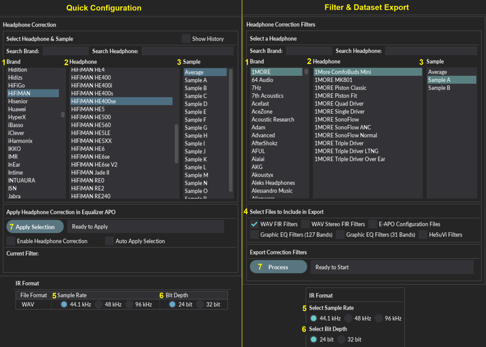
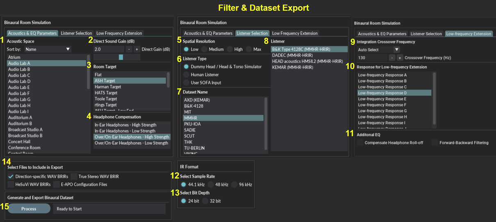

**[Download Latest Windows Release](https://sourceforge.net/projects/ash-toolset/)**

**[Source Code](https://github.com/ShanonPearce/ASH-Toolset)**

The Audio Spatialisation for Headphones Toolset is a set of tools for headphone correction and binaural synthesis of spatial audio systems on headphones.

---
## Features  
- **Headphone Correction** — Generate headphone correction filters in WAV format for IR convolution or as configurations for graphic equalisers.
- **Binaural Room Simulation** —  Generate customised binaural simulations of different acoustic environments including control rooms, studios, halls, and more. Resulting filters can be saved in WAV format or SOFA format for IR convolution.
- **Equalizer APO Integration** —  Auto configures Equalizer APO to apply created filters and perform headphone correction and binaural room simulation.
- **HeSuVi Compatibility** —  Generates filters in formats compatible with HeSuVi, a headphone surround virtualization tool for Equalizer APO.
- **SOFA Format Compatibility** - Load HRTF datasets and export customised binaural responses in SOFA format

---
## Windows Installation  

1.  Download the [latest release](https://sourceforge.net/projects/ash-toolset/) and run the installer or download the portable package and unzip to the location of your choice.
2.  When running the executable, if a Microsoft Defender Smartscreen warning is presented, click 'More info' and 'Run anyway'. This warning may show on some releases due to the code signing certificate of the executable building reputation.
3.  (optional) If using Equalizer APO for audio processing, download [Equalizer APO](http://sourceforge.net/projects/equalizerapo) and follow the Equalizer APO [installation tutorial](https://sourceforge.net/p/equalizerapo/wiki/Documentation/#installation-tutorial). 
4.  (optional) If using HeSuVi for audio processing, download [HeSuVi](https://sourceforge.net/projects/hesuvi/) and follow the installation and usage steps outlined in the [HeSuVi Wiki](https://sourceforge.net/p/hesuvi/wiki/Help/).

---
## Usage  

Run the application as administrator to launch the GUI. It may take a few seconds for it to launch.

### GUI Overview
The app contains the following 3 tabs:
- The 'Quick Configuration’ tab can be used to directly apply headphone correction and binaural room simulation in Equalizer APO
- The ‘Filter & Dataset export’ tab can be used to export correction filters and binaural datasets to a local directory
- The ‘Additional Tools & Settings’ tab contains some miscellaneous options and log messages

---
### Headphone Correction
In the 'Quick Configuration’ tab, this tool is used to apply headphone correction in Equalizer APO. In the ‘Filter & Dataset export’ tab, this is used to export a set of correction filter files for a specific headphone which can then be loaded into audio processing software to apply headphone correction.

1. **Select a headphone brand** to filter down on the headphone list.
2. **Select a specific headphone**.
3. **Select a specific sample**. Note that in the ‘Filter & Dataset export’ tab, all samples will be exported for the selected headphone.
4. (‘Filter & Dataset export’ tab only) Select which files to include in the export.
   - FIR Filters: Minimum phase FIRs in WAV format for convolution. 1 channel at specified sample rate and bit depth. This is filter type is required for the app to auto-configure 'config.txt' in Equalizer APO.
   - Stereo FIR Filters: Minimum phase FIRs in WAV format for convolution. 2 channels at specified sample rate and bit depth.
   - E-APO Configuration files: configuration files that can be loaded into Equalizer APO to perform convolution with the FIR filters. This feature is deprecated from V2.0.0 onwards due to inclusion of auto-configure 'config.txt' feature.
   - Graphic EQ Filters (127 bands): Graphic EQ configurations with 127 bands. Compatible with Equalizer APO and Wavelet
   - Graphic EQ Filters (31 bands): Graphic EQ configurations with 31 bands. Compatible with 31 band graphic equalizers including Equalizer APO
   - HeSuVi Filters: Graphic EQ configurations with 127 bands. Compatible with HeSuVi. Saved in HeSuVi\eq folder
5. **Select a sample rate** for the WAV files. Available options are 44.1kHz, 48kHz, and 96kHz. Note: The sample rate of the generated fitlers should match the sample rate of the sound device.
6. **Select a bit depth** for the WAV files. Available options are 24 bits per sample and 32 bits per sample.
7. **Click the 'Apply Selection' button** to apply the selected filter in Equalizer APO or **click the 'Process' button** to export the selected filters to the output directory. By default this location will be `C:\Program Files\EqualizerAPO\config\ASH-Outputs` but can be changed using the change folder option.

---
###  Binaural Room Simulation over Headphones
#### Quick Configuration
In the 'Quick Configuration’ tab, this tool is used to apply customised binaural room simulations over headphones in equalizer APO. 

1. **Select Acoustic Space** from a range of environments including audio labs, conference rooms, control rooms, seminar rooms, studios, and more. This will determine the listening environment of the simulation.
2. **Select Gain for Direct Sound** in dB. Select a value between -10dB and 10dB. Higher values will result in lower perceived distance. Lower values result in higher perceived distance
3. **Select Room Target** from a range of options including flat, ASH target, Harman target, and more. This will influence the overall balance of low and high frequencies. Flat is recommended if using headphone correction from other sources such as AutoEq. Variations of below targets with flat mid and high frequencies are also provided.
4. **Select Headphone Compensation** from below options. The selected option should match the listener's headphone type. High strength is selected by default. Reduce to low strength if sound localisation or timbre is compromised.
   - In-Ear Headphones, high strength
   - In-Ear Headphones, low strength
   - Over-Ear/On-Ear Headphones, high strength
   - Over-Ear/On-Ear Headphones, low strength
5. **Select Listener Type** from below options.
   - Dummy Head / Head & Torso Simulator
   - Human Listener
   - User SOFA Input
6. **Select Dataset** from available options. A number of public HRTF datasets will be listed here if ‘Listener Type’ is set to 'Dummy Head / Head & Torso Simulator' or 'Human Listener'.
7. **Select Listener** from available options. Some options will require an internet connection as the source dataset is not included and will be automatically downloaded from the web. If ‘Listener Type’ is set to ‘User SOFA Input’, user SOFA files will be automatically listed here. User SOFA files must be placed in the user data folder which is usually located at `C:\Program Files (x86)\ASH Toolset\_internal\data\user\SOFA`. Additional SOFA files can be found at the [SOFA conventions repository](https://www.sofaconventions.org/mediawiki/index.php/Files).
8. **(optional) Select Subwoofer Crossover Frequency** between 40Hz and 150Hz. Auto Select mode will select an optimal frequency for the selected acoustic space. This can be used to tune the integration of the cleaner subwoofer response and original room response. Higher values may result in a smoother bass response. 
9. **Select Subwoofer Response** from available options. A comparison of responses are available in the supporting information section below.
10. **(optional) Enable Additional EQ**. Compensate Headphone Roll-off option will compensate the typical reduction in bass response below 100Hz in many headphones. This filter will result in a gain of approximately 4dB at 20Hz. Forward-Backward Filtering option will eliminate delay introduced by the filters, however can introduce edge artefacts in some cases.
11. **Select Sample Rate** for the WAV files. Available options are 44.1kHz, 48kHz, and 96kHz. Note: The sample rate of the generated WAV files should match the sample rate of the sound device.
12. **Select Bit Depth** for the WAV files. Available options are 24 bits per sample and 32 bits per sample.
13. **Click the 'Apply Parameters' button** to apply the binaural simulation in Equalizer APO.

#### Filter & Dataset export
In the ‘Filter & Dataset export’ tab, this is used to export a customised binaural dataset containing binaural impulse responses in WAV or SOFA format which can then be loaded into audio processing software to apply room simulation.

1. **Select Acoustic Space** from a range of environments including audio labs, conference rooms, control rooms, seminar rooms, studios, and more. This will determine the listening environment of the simulation.
2. **Select Gain for Direct Sound** in dB. Select a value between -10dB and 10dB. Higher values will result in lower perceived distance. Lower values result in higher perceived distance
3. **Select Room Target** from a range of options including flat, ASH target, Harman target, and more. This will influence the overall balance of low and high frequencies. Flat is recommended if using headphone correction from other sources such as AutoEq. Variations of below targets with flat mid and high frequencies are also provided.
4. **Select Headphone Compensation** from below options. The selected option should match the listener's headphone type. High strength is selected by default. Reduce to low strength if sound localisation or timbre is compromised.
   - In-Ear Headphones, high strength
   - In-Ear Headphones, low strength
   - Over-Ear/On-Ear Headphones, high strength
   - Over-Ear/On-Ear Headphones, low strength
5. **Select Spatial Resolution** from below options. Increasing resolution will increase number of source directions available but will also increase processing time and dataset size. Low' is recommended unless additional directions or SOFA export is required.
   - Low: Elevation angles ranging from -30 to 30 degrees in 15 degree steps. Azimuth angles ranging from 0 to 360 degrees in varying steps.
   - Medium: Elevation angles ranging from -45 to 45 degrees in 15 degree steps. Azimuth angles ranging from 0 to 360 degrees in varying steps.
   - High: Elevation angles ranging from -50 to 50 degrees (WAV export) or -60 to 60 degrees (SOFA export) in 5 degree steps. Azimuth angles ranging from 0 to 360 degrees in 5 degree steps.
   - Max: Elevation angles ranging from -40 to 40 degrees (WAV export) or -40 to 60 degrees (SOFA export) in 2 degree steps. Azimuth angles ranging from 0 to 360 degrees in 2 degree steps.
6. **Select Listener Type** from below options.
   - Dummy Head / Head & Torso Simulator
   - Human Listener
   - User SOFA Input
7. **Select Dataset** from available options. A number of public HRTF datasets will be listed here if ‘Listener Type’ is set to 'Dummy Head / Head & Torso Simulator' or 'Human Listener'.
8. **Select Listener** from available options. Some options will require an internet connection as the source dataset is not included and will be automatically downloaded from the web. If ‘Listener Type’ is set to ‘User SOFA Input’, user SOFA files will be automatically listed here. User SOFA files must be placed in the user data folder which is usually located at `C:\Program Files (x86)\ASH Toolset\_internal\data\user\SOFA`. Additional SOFA files can be found at the [SOFA conventions repository](https://www.sofaconventions.org/mediawiki/index.php/Files).
9.  **(optional) Select Subwoofer Crossover Frequency** between 40Hz and 150Hz. Auto Select mode will select an optimal frequency for the selected acoustic space. This can be used to tune the integration of the cleaner subwoofer response and original room response. Higher values may result in a smoother bass response. 
10. **Select Subwoofer Response** from available options. A comparison of responses are available in the supporting information section below.
11. **(optional) Enable Additional EQ**. Compensate Headphone Roll-off option will compensate the typical reduction in bass response below 100Hz in many headphones. This filter will result in a gain of approximately 4dB at 20Hz. Forward-Backward Filtering option will eliminate delay introduced by the filters, however can introduce edge artefacts in some cases.
12. **Select Sample Rate** for the WAV or SOFA files. Available options are 44.1kHz, 48kHz, and 96kHz. Note: The sample rate of the generated WAV files should match the sample rate of the sound device.
13. **Select Bit Depth** for the WAV files. Available options are 24 bits per sample and 32 bits per sample.
14. Select which files to include in the export.
    - Direction specific WAV BRIRs: Binaural Room Impulse Responses (BRIRs) in WAV format for convolution. One file for each source direction and 2 channels per file at specified sample rate and bit depth. This is file type is required for the app to auto-configure 'config.txt' in Equalizer APO.
    - True Stereo WAV BRIRs: True Stereo BRIR in WAV format for convolution. One file with 4 channels representing L and R speakers (LL LR RL RR) at specified sample rate and bit depth.
    - HeSuVi WAV BRIRs: BRIRs in HeSuVi compatible WAV format. 14 channels, 24 or 32 bit depth, 44.1Khz and 48Khz. The directions of the channels can be configured in the 'HeSuVi Channel Configuration' tab on the right.
    - E-APO Configuration Files: configuration files that can be loaded into Equalizer APO to perform convolution with BRIRs. This feature is deprecated from V2.0.0 onwards due to inclusion of auto-configure 'config.txt' feature.
    - SOFA File: BRIR dataset file in SOFA (Spatially Oriented Format for Acoustics) format. The SOFA convention can be selected in the Misc. Settings section under 'Additional Tools & Settings' tab.
15. **Click the 'Process' button** to export the binaural dataset to the output directory.

---
### Using the Correction Filters and Binaural Simulations

The outputs can be used to create spatial surround sound on headphones by convolving an audio stream with a set of binaural impulse responses and a headphone correction filter. This requires IR Convolution software that supports stereo or true stereo processing such as Equalizer APO

### Apply Filters and Simulations in Equalizer APO
V3.0.0 onwards of the toolset includes a 'Quick Configuration’ tab which will auto-configure 'config.txt' to apply selected filters and binaural simulations in Equalizer APO. Ensure 'Enable Headphone Correction' and/or 'Enable Binaural Room Simulation' are ticked for the changes to apply. The audio channels can be configured in the 'Channel Configuration' tab on the right side of the app.

- The preamplification control will apply the specified gain to all channels. An option to auto-adjust preamp has been included from V3.1.0 onwards. This option can be set to prevent all clipping, or align levels in low or mid frequencies which will keep levels consistent while comparing different simulations.
- The estimated peak gain table can be used to identify potential clipping that may occur for different input channel configurations. Max. peak gain is the highest peak gain across the left and right channels whereas average peak gain is the average peak gain of the left and right channels. 
- The input audio channel configuration can be selected using the drop down. The selected channel configuration must be supported by the sound device. An option to upmix 2.0 stereo to 7.1 is included. The upmix has available 2 methods: Method A which is a simple channel duplication and Method B which also includes Mid/Side channel separation.
- The gains and source directions of each audio channel can be configured separately.

### 7.1 Surround Virtualisation

If your audio device does not support a 7.1 surround channel configuration, a virtual audio device such as [VB-Audio Virtual Cable](https://www.vb-audio.com/Cable/index.htm) or [Voicemeeter](https://www.vb-audio.com/Voicemeeter/index.htm) can be used for audio processing in place of your regular audio playback device. Equalizer APO can be installed on the virtual audio device which can be configured for 7.1 audio, and the output of the virtual audio device can be sent to your regular audio playback device.

### Apply Filters and Simulations in HeSuVi

As an alternative to above method in Equalizer APO, the generated filters can be applied using HeSuVi.

1. If using HeSuVi for the first time, download [HeSuVi](https://sourceforge.net/projects/hesuvi/) and follow the installation and usage steps outlined in the [HeSuVi Wiki](https://sourceforge.net/p/hesuvi/wiki/Help/).
2. Open or restart HeSuVi
3. The binaural room simulations can be selected in the `Virtualisation` tab. The simulation can be found under the `Common HRIRs` section at the top of the list.
4. The headphone correction filters can be selected in the `Equalizer` tab. The filters can be found under `_HpCFs` at the bottom of the list.

---
### Acoustic Space Import

This tab can be used to generate new acoustic spaces from reverberant impulse response (IR) files such as room impulse responses (RIRs). Imported acoustic spaces can be used in the quick configuration and filter & dataset export tabs.

**Set IR Folder**
- To prepare new inputs, click **“Open Input Folder”** to open the directory where IR folders should be stored.
  - Ensure all IR files for one space are grouped into a **single subfolder** (e.g., `Room A`).
  - **Supported file types:** `.wav`, `.sofa`, `.mat`, `.npy`, `.hdf5`
- Click **“Refresh Folder List”** to load available IR folders if new folder was created.
- Select a folder from the **IR Folder List** dropdown. 

**Enter Metadata (Optional)**
- **Name:** Enter a name for the acoustic space. If left blank, the folder name will be used.
- **Description:** Enter a brief description of the space.

**IR Processing Options** 
- **Long Reverb Tail Mode:**  
  Enable if IRs have long decay tails (over 1.5 seconds). This increases processing time.
- **Noise Reduction:**  
  Enable if IRs contain a high noise floor.

**Spatial Sampling**
- **Desired Directions:**  
  Specify the number of simulated source directions to generate.  
  - Minimum: `1000`, Maximum: `3000` (default: `1750`)
  - Lower values will reduce processing time.
- **Alignment Frequency (Hz):**  
  Set the cutoff frequency for time-domain alignment.  
  - Minimum: `50`, Maximum: `150` (default: `110`)

**Pitch Shifting (for dataset expansion)**

The below parameters are only used to expand the dataset with new simulated source directions in cases where few IRs are supplied
- **Pitch Shift Range:**
  - **Low:** Minimum pitch shift in semitones. *(default: `0.0`)*
  - **High:** Maximum pitch shift in semitones. *(default: `24.0`)*
- **Pitch Shift Compensation:**  
  Enable to correct frequency response of pitch-shifted IRs. May introduce artifacts.

**Start Processing**
- Click **“Start Processing”** to begin.
  - Processing may take several minutes depending on the dataset and settings.

---
### Room Target Generator

This tab can be used to create custom room target curves using low-shelf and high-shelf filters. These targets can be used later in quick configuration and dataset export.

**Enter Target Name (Optional)**
- **Name:** Provide a name for your new room target.
  - If left blank, a name will be auto-generated based on the filter parameters.

**Configure Low-Shelf Filter**
- **Frequency (Hz):**  
  Set the cutoff frequency for the low-shelf filter.  
  - Range: `20–1000 Hz` (default: `100 Hz`)
- **Gain (dB):**  
  Set the gain.  
  - Negative values attenuate low frequencies.  
  - Range: `-6.0 to 18.0 dB` (default: `6.0 dB`)
- **Q-Factor:**  
  Controls the slope of the filter.  
  - Lower values = broader curve.  
  - Range: `0.1 to 5.0` (default: `0.707`)

**Configure High-Shelf Filter**
- **Frequency (Hz):**  
  Set the cutoff frequency for the high-shelf filter.  
  - Range: `1000–20000 Hz` (default: `7000 Hz`)
- **Gain (dB):**  
  Set the gain.  
  - Positive values boost high frequencies.  
  - Range: `-18.0 to 6.0 dB` (default: `-4.0 dB`)
- **Q-Factor:**  
  Controls the slope of the filter.  
  - Lower values = broader curve.  
  - Range: `0.1 to 5.0` (default: `0.4`)

**Generate the Room Target**
- The **Room Target Name** will be displayed below if entered.
- Click **“Generate Target”** to apply your filter settings.
  - The new target will be saved and made available in the **Quick Config** and **Dataset Export** tabs.

---
### File Naming and Structure
Outputs (excluding HeSuVi files) are saved within the `ASH-Outputs` child folder under the output directory. This will be in the Equalizer APO config directory (e.g. `C:\Program Files\EqualizerAPO\config\ASH-Outputs`) by default. HeSuVi files will be saved within the HeSuVi folder (e.g. `C:\Program Files\EqualizerAPO\config\HeSuVi`) by default. If required, the output directory can be changed using the directory selector. The `EqualizerAPO\config` directory should be selected if using Equalizer APO to ensure the filters and configurations can be read by Equalizer APO. 

**Binaural Room Impulse Responses**
- Binaural room impulse responses are saved within the ASH-Outputs\BRIRs folder.
- A folder is created for each set of WAV BRIRs and is named as per the selected parameters.
    - The naming convention for the folder is `(Listener)_(Acoustic_Space)_(Direct_Sound_Gain)_(Room_Target)_(Headphone_Type)`.
- A WAV file is created for a range of source directions around the listener. Each WAV file corresponds to a unique direction.
    - The naming convention for the BRIR WAV files is `BRIR_E(Elevation)_A(Azimuth).wav`.
    - Positive elevation angles correspond to points above the listener while negative angles correspond to points below the listener. An elevation of 0 corresponds to a point at the same level as the listener.
    - Positive azimuth angles correspond to points to the right of the listener while negative angles correspond to points to the left of the listener. An azimuth of -90 corresponds to a point directly to the left of the listener while an azimuth of 90 corresponds to a point directly to the right of the listener.
- A true stereo WAV file is also located in each folder with naming `BRIR_True_Stereo.wav`
- SOFA files are located under the SOFA folder

**Headphone Correction Filters**
- Correction filters are saved within the ASH-Outputs\HpCFs folder
- A folder is created for each filter type and for each headphone brand that has an exported filter
- The filters are named as per the headphone name

**Equalizer APO Configurations (deprecated)**
- Equalizer APO configurations are saved within the ASH-Outputs\E-APO-Configs folder
- Folders follow the same naming as above filters and binaural datasets
- A set of IR convolution configuration files are created for each binaural dataset and for a range of common speaker configurations including Stereo, 5.1 surround, & 7.1 surround.
- A set of IR convolution configuration files are created for each headphone correction filter

---
## Supporting Information  

### Supported SOFA Conventions

| Convention          | Version | SOFAConventionsVersion | Read | Write |
| ------------------- | ------- | ---------------------- | ---- | ----- |
| GeneralFIR          | 2.1     | 1                      | Yes  | No    |
| GeneralFIR          | 1       | 1                      | Yes  | Yes   |
| SimpleFreeFieldHRIR | 2.1     | 1                      | Yes  | No    |
| SimpleFreeFieldHRIR | 1       | 1                      | Yes  | Yes   |
| SimpleFreeFieldHRIR | 0.6     | 0.4                    | Yes  | No    |
| SimpleFreeFieldHRIR | 0.5     | 0.3                    | Yes  | No    |
| GeneralFIRE         | 1       | 1                      | Yes  | No    |
| GeneralFIRE         | 0.6     | 0.1                    | Yes  | No    |
| GeneralFIR-E        | 2.1     | 2                      | Yes  | No    |
| FreeFieldHRIR       | 2.1     | 1                      | Yes  | No    |

### Acoustic Spaces

| Name               | Estimated RT60 (ms)  | Name             | Estimated RT60 (ms)  | Name           | Estimated RT60 (ms)  |
|--------------------|----------------------|------------------|----------------------|----------------|----------------------|
| Atrium A           | 2894                 | Conference Room  | 467                  | Outdoors B     | 1183                 |
| Atrium B           | 1243                 | Control Room     | 260                  | Outdoors C     | 1312                 |
| Audio Lab A        | 305                  | Courtyard        | 1375                 | Recording Room | 275                  |
| Audio Lab B        | 413                  | Foyer            | 1213                 | Seminar Room A | 839                  |
| Audio Lab C        | 508                  | Hall A           | 1418                 | Seminar Room B | 710                  |
| Audio Lab D        | 193                  | Hall B           | 929                  | Seminar Room C | 705                  |
| Audio Lab E        | 442                  | Hall C           | 719                  | Seminar Room D | 685                  |
| Audio Lab F        | 631                  | Hall D           | 1118                 | Small Room A   | 500                  |
| Audio Lab G        | 360                  | Hall E           | 1405                 | Small Room B   | 437                  |
| Audio Lab H        | 528                  | Kiln             | 780                  | Small Room C   | 467                  |
| Audio Lab I        | 539                  | Large Room A     | 624                  | Small Room D   | 463                  |
| Auditorium A       | 1455                 | Large Room B     | 576                  | Small Room E   | 476                  |
| Auditorium B       | 901                  | Lecture Room     | 704                  | Small Room F   | 474                  |
| Auditorium C       | 431                  | Listening Room A | 221                  | Small Theatre  | 1019                 |
| Auditorium D       | 1246                 | Listening Room B | 379                  | Smoking Room   | 646                  |
| Broadcast Studio A | 1183                 | Listening Room C | 562                  | Studio A       | 398                  |
| Broadcast Studio B | 1241                 | Listening Room D | 312                  | Studio B       | 351                  |
| Chamber A          | 1477                 | Listening Room E | 824                  | Studio C       | 723                  |
| Chamber B          | 811                  | Listening Room F | 771                  | Studio D       | 739                  |
| Classroom          | 964                  | Listening Room G | 233                  | Tatami Room    | 513                  |
| Concert Hall A     | 1599                 | Lobby            | 778                  | Tennis Court   | 1415                 |
| Concert Hall B     | 1565                 | Office A         | 408                  | Theatre        | 889                  |
| Concert Hall C     | 1493                 | Office B         | 496                  | Tunnel         | 1354                 |
| Concert Hall D     | 1417                 | Outdoors A       | 1935                 |                |                      |

### Subwoofer Responses

| Name                 | Acoustic space | Estimated rt60 | Frequency Range | Tolerance           | Comments                             |
|----------------------|----------------|----------------|-----------------|---------------------|--------------------------------------|
| Subwoofer Response A | Audio Lab      | 320            | 3Hz-150Hz       | 20Hz-120Hz +/-0.8dB | Primary response used in v3.1.2      |
| Subwoofer Response B | Audio Lab      | 340            | 0Hz-150Hz       | 20Hz-120Hz +/-1.0dB | Newly added in v3.2.0                |
| Subwoofer Response C | Listening Room | 350            | 5Hz-150Hz       | 20Hz-120Hz +/-1.4dB | Previously used in ASH-Listening-Set |
| Subwoofer Response D | Studio         | 240            | 0Hz-150Hz       | 20Hz-120Hz +/-1.0dB | Newly added in v3.2.0                |

---
## Changelog  
Version 3.3.0:
- Added new tool: Acoustic Space Import. This can be used to generate new acoustic spaces from impulse response (IR) files. Imported acoustic spaces can be used in the quick configuration and filter & dataset export tabs.
- 24 new acoustic spaces added
- Added new tool: Room Target Generator. This can be used to create new room targets which can be used in the quick configuration and filter & dataset export tabs.
- Saved settings will now be stored in windows user directory and will not be reset following an app update 
- Fixed issue causing Auto-adjust preamp options to reduce preamp values by a small constant value
- Fixed issue causing right most panel to be cut short on smaller windows resolutions
- Fixed issue causing missing acoustic spaces to cause app to fail on launch
- Supporting information has been moved to a separate tab
- Added option to clear history in headphone correction panel
- Added option to open windows sound control panel
- Added confirmation window for clear history button
- Optimised binaural dataset generation function
- 
Version 3.2.0:
- Added parameters to binaural simulations for low frequency extension. Subwoofer response can be selected and crossover frequency can be adjusted. Some additional low frequency filtering options have also been added. Magnitude response and group delays can also be plotted in the new low frequency analysis tab.
- New acoustic spaces added: Atrium, Auditorium B, Listening Room A-G, Office B, Seminar Room C & D, Studio C & D. Some existing acoustic spaces have also been optimised
- Added an option to sort acoustic spaces by reverberation time
- Added options to align levels in low or mid frequencies in auto-adjust preamp control
- Added support for additional HRTF dataset: CIPIC
- Minor optimisations made to processing of binaural simulations
- Fixed issue causing downloaded HRTF SOFA datasets to not be resampled to correct sampling rate.
- Fixed issue causing IRs with high reverberation times to be excessively trimmed
- When user clicks show history, previously selected headphone will continue to be selected

Version 3.1.2:
- New acoustic spaces added: Small Room E, Small Room F
- Optimised and streamlined processing of binaural simulations and exporting datasets. Removed ‘Reduce dataset size’ button as it was no longer required
- Added support for latest SOFA versions for GeneralFIR, SimpleFreeFieldHRIR, GeneralFIR-E & FreeFieldHRIR conventions
- Increased limits of the direct gain control

Version 3.1.1:
- Fixed issue causing duplicate listener names under some datasets
- Fixed issue causing inconsistent gains across different HRTF datasets
- Removed incompatible HRTF datasets

Version 3.1.0:
- Added new Headphone Correction Filters. Refer to hpcf_database_changelog for details.
- Added new listeners from various public HRTF datasets. Listener types are split into dummy head and individual listener. Some selections will require an internet connection as the source dataset will be automatically downloaded from the web. 
- Added the ability to load SOFA format HRTF datasets. User SOFA files must be placed in '\ASH Toolset\_internal\data\user\SOFA' folder. SOFA files will be automatically listed under ‘Listener’ once ‘Listener Type’ is set to ‘User SOFA Input’.
- New acoustic spaces added: Small Room A, Small Room B, Small Room C, Small Room D, Large Room A, Large Room B
- Added option to upmix from 2.0 stereo to 7.1 surround
- Added ability to select SOFA convention for SOFA outputs. Option is located under Misc. Settings.
- Added option to reduce binaural dataset size in quick configuration to reduce processing time and files written. Processes a smaller dataset containing only required directions. 
- Added ability to configure directions (elevations and azimuths) for Hesuvi WAV outputs. Option is located under ‘HeSuVi Channel Configurations’ tab.
- Added option to auto adjust preamp for clipping prevention in Equalizer APO
- Fixed issue causing SOFA export to fail in the windows app
- Fixed issue causing reset settings button to not reset channel configs
- Fixed issue on app start sometimes causing convolution to be activate for a headphone filter that is not yet applied
- Fixed issue causing convolution to be disabled once auto apply is deselected 
- Various GUI changes including new tab for listener selection, additional supporting information, splash screen.

Version 3.0.4:
- Added an option to add a delay between the direct sound and early reflections. ”Early Reflection Delay (ms)” is located under “Misc. Settings” in “Additional Tools & Log” tab. This will increase the time between the direct sound and early reflections and can be used to increase perceived distance.

Version 3.0.3:
- BRIRs are now automatically trimmed to remove empty tails and reduce their lengths
- Fixed issue causing gains to not be adjusted when processing a new binaural simulation in quick configuration when headphone correction is not enabled
- Adjusted colours to ensure each tab has a consistent colour theme
- Minor improvement to extension of low frequency response below 20Hz

Version 3.0.2:
- Fixed issue causing incorrect simulation name to be shown when parameters are changed during processing of new simulation
- Fixed issue causing the new Force Left/Right Symmetry option to be ignored for binaural dataset exports

Version 3.0.1:
- Added option to force symmetry of HATS / dummy heads by mirroring left or right sides. This option is located under Additional Tools & Log -> Misc. Settings
- ‘Include hesuvi.txt’ command in Equalizer APO will automatically be disabled if quick configuration is active in ASH toolset
- Regenerated ‘broadcast studio’ and ‘hall’ acoustic spaces resulting in some minor improvements to reverberation quality

Version 3.0.0:
- Added ‘Quick Configuration’ tab which can be used to apply headphone correction and binaural room simulation in Equalizer APO
- Added ‘Filter & Dataset export’ tab which can be used to export correction filters and binaural datasets to a local directory
- Added ‘Additional Tools & Log’ tab for miscellaneous options and log messages
- Improved efficiency of binaural dataset generation resulting in faster processing times
- Various GUI changes
- Regenerated audio_lab_h acoustic space resulting in some minor improvements to reverberation quality
- Minor improvements to low frequency extension

Version 2.4.0:
- Added new acoustic spaces: Audio Lab I, Lecture Room, Outdoors B, Seminar Room B, Studio B
- Added  approx. 25 new headphone correction filters
- Gains are now more consistent across acoustic spaces
- Data output sub-directory renamed to ‘ASH-Outputs’
- Added option to auto check for updates on app start. Located under ‘Additional Tools & Settings’
- Added option to check for updates to acoustic spaces. Located under ‘Additional Tools & Settings’
- Regenerated existing acoustic spaces resulting in some minor improvements to reverberation quality
- Minor changes made to GUI
- Fixed issue causing check for headphone filter updates to fail
- Fixed issue causing current simulation tag to not update after deleting a dataset

Version 2.3.0:
- Fixed issue causing HeSuVi exports to fail for acoustic spaces with high reverberation times
- Improved extension of low frequency response below 20Hz
- Improvements made to headphone compensation for over ear & on ear headphone types
- GUI now shows reverberation times and spatial resolution breakdown under ‘Supporting information’ tab
- Output locations section now show directories for main outputs and HeSuVi outputs separately

Version 2.2.0:
- Added options for different types of acoustic spaces including audio lab, control room, studio, hall, and more.
- Added filter previews for HRTFs and headphone compensation
- Added additional variants for existing room targets with flat mid & high frequencies
- Added button to cancel processing of binaural dataset
- Minor GUI changes
- Filter preview of first headphone no longer shown on app start
- Fixed issue causing front/back directions to be reversed for the MMHR HATS
- Fixed issue causing reduced gains and lack of extension in sub frequencies

Version 2.1.0:
- Added options to select spatial resolution of BRIR dataset. This will increase number of source directions available and increase size of exported dataset
- Added option to export BRIRs to SOFA format. Only available for High and Max spatial resolution options
- Fixed issue causing gains to vary between directions
- Fixed issue causing errors when performing equalizer apo configuration updates when BRIR list was empty
- Fixed issue causing settings to not be saved when making selections while BRIR processing is running
- Updated GUI. Output directory selector is now located under filter creation section. Developer tools are now hidden in main release.
- Added functions to perform head pose tracking via webcam. Currently experimental and can only be enabled under developer tools in the dev distribution

Version 2.0.0:
- Note: it is recommended to delete any BRIRs exported from previous versions before using the new auto-configure config.txt feature in V2.0.0
- Added functions to browse exported filters and auto-configure config.txt in Equalizer APO to apply selected filters
- Added functions to delete exported HpCF or BRIR filters
- Added sliders for reverberation time and direct gain
- Added function to reset settings to default. Located under additional tools and settings
- Added function to show/hide sections of the app and autosize window on app start. Located under additional tools and settings
- Rearranged GUI elements. Output directory selector is now located under additional tools and settings
- Reduced size of app window when display resolution is smaller than app window size

Version 1.2.0:
- Added new HATS / dummy heads: Neumann KU 100 (TH Köln), FABIAN HATS, KEMAR-L (MIT), KEMAR (PKU-IOA).
- Added new options for headphone compensation. High strength or low strength variants can be selected.
- Added function to check for latest app version and hpcf dataset version. Located in 'additional tools' section.
- Added function to delete saved files (BRIRs, HpCFs) from output folder. Located in 'additional tools' section.
- Fixed issue in GUI. Previously saved settings were not loaded correctly when reopening the app.
- Fixed issue causing inconsistent direct gains between HATS.

Version 1.1.0:
- Added WAV export options for 24 bit and 32 bit depths along with 48kHz and 96kHz sample rates.
- Added search boxes to filter down on brand and headphone.
- Improved quality of resampled IRs.
- Adjusted gains of Equalizer APO configurations to align levels of BRIRs across different dummy heads.
- Added new HpCFs for a range of headphones. Refer to hpcf_database_changelog for list of new additions.

Version 1.0.0:
- Initial release

---
## License  
ASH-Toolset is distributed under the terms of the GNU Affero General Public License v3.0 (AGPL-3.0). A copy of this license is provided in the file LICENSE.

## Contact  

Shanon Pearce - srpearce55@gmail.com

Project Link: [https://github.com/ShanonPearce/ASH-Toolset](https://github.com/ShanonPearce/ASH-Toolset)

## Acknowledgments  

This project makes use of various publicly available HRIR, RIR, and BRIR datasets. Refer to the sheets provided in the [github docs folder ](https://github.com/ShanonPearce/ASH-Toolset/tree/main/docs) for information on the raw datasets used in this project. Further information on the HRTF datasets can be found at the [SOFA conventions repository](https://www.sofaconventions.org/mediawiki/index.php/Files). 
